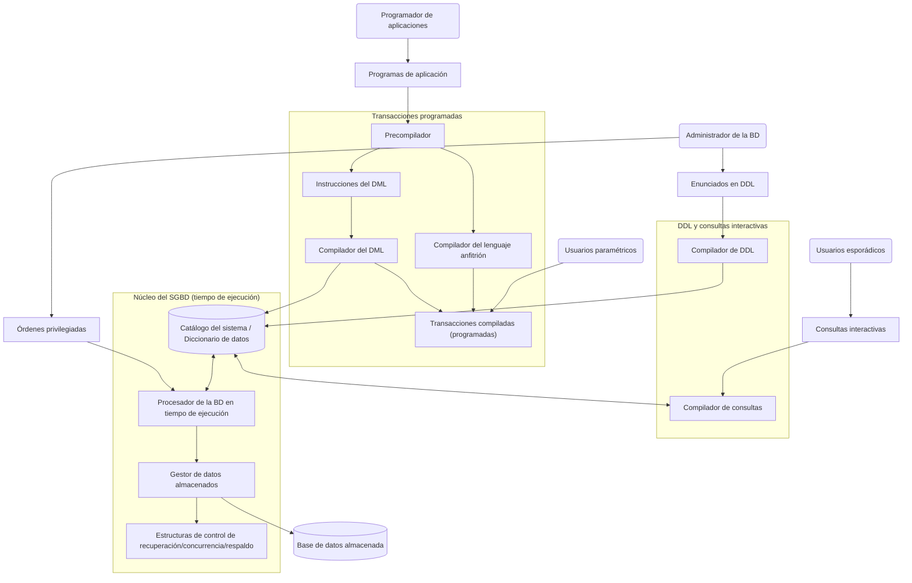

# Modelo de datos

## 1. Introducción

Antes de hablar de modelos de datos conviene preguntarse por qué se usan modelos
en primer lugar. Un modelo es, ante todo, una forma de comunicación: para que
funcione, quienes lo usan deben compartir cierto conocimiento común sobre qué
representa cada símbolo y cada regla. Todo modelo remarca ciertos aspectos de la
realidad y descarta otros (nunca es la realidad misma), y se describe siempre en
algún lenguaje (gráfico, matemático, textual).

> "Highways are not painted red, rivers don't have county lines running down the
> middle, and you can't see contour lines on a mountain." (Kent, 1978)

Un **modelo de datos** es una herramienta para obtener, a partir de los datos,
una abstracción del mundo real que se quiere representar. No alcanza con guardar
los "valores", hace falta conservar también una interpretación o significado de
esos valores. Por eso un buen modelo de datos debe ser, a la vez:

- **Flexible**, para poder reflejar un mundo real que no es estático, y las
  distintas interpretaciones (vistas) que tienen de él los distintos
  observadores.
- **Expresivo** (con suficiente potencia semántica) como para describir esa
  realidad de la forma más exacta posible. Tiene que mostrar el "bosque", no
  los árboles.

Como cualquier modelo (matemático, físico, económico, un mapa, un plano), es
imposible representarlo todo: hay que tener claros los límites de lo que se
quiere representar y para qué se lo necesita (de ahí la idea de datos
**operativos**).

Formalmente:

> Un **modelo de datos** provee las reglas para representar la estructura de los
> datos, sus restricciones, y las operaciones permitidas sobre ellos.

### 1.1. Niveles o tipos de modelo de datos

Según el tipo de usuario que los interpreta, se distinguen tres niveles:

- **Modelo de alto nivel (conceptual):** Pensado para usuarios finales, describe
  la realidad con conceptos cercanos a cómo la gente percibe el mundo
  (entidades, relaciones), sin detalles de implementación.
- **Modelo de representación (implementación):** Sus conceptos pueden ser
  entendidos por los usuarios finales, aunque ya no están tan alejados de la
  forma en que los datos se organizan dentro de la computadora, ocultan algunos
  detalles de almacenamiento. Son los más usados por los sistemas gestores de
  bases de datos comerciales. Hay cuatro modelos históricamente relevantes en
  este nivel: el **relacional**, el de **red**, el **jerárquico** y el
  **orientado a objetos**.
- **Modelo de bajo nivel (físico):** Dirigido a especialistas en computación,
  describe cómo se almacenan realmente los datos (formatos de registro,
  ordenamiento, rutas de acceso, índices).

### 1.2. ¿Qué debe poder describir un modelo de datos?

Un modelo de datos es, en definitiva, una colección de herramientas conceptuales
para describir:

- Los datos.
- Las relaciones entre esos datos.
- Su semántica (el significado que tienen).
- Las restricciones de consistencia que deben cumplir.

**Ejemplos de modelos de datos** usados en la práctica: el modelo relacional, el
modelo entidad-relación, el modelo de datos orientado a objetos, y modelos de
datos semiestructurados (XML). Lo precedieron históricamente el modelo de datos
de red y el modelo de datos jerárquico.

---

## 2. Historia de las bases de datos

### 2.1. Hasta principios de los años 60

- Correspondencia total entre estructura lógica y física: cambiar el soporte de
  la información implicaba cambiar los programas.
- Procesamiento por lotes (_batch_).
- Los datos eran para una única aplicación: alto nivel de redundancia (cada
  usuario tenía sus propios archivos, por lo que el mismo dato terminaba
  repetido en varios archivos).
- Almacenamiento en **cintas** (acceso secuencial).
- Las transacciones sobre el archivo maestro se acumulaban en un archivo de
  transacciones que lo actualizaba cada cierto lapso de tiempo: retraso entre el
  momento en que se produce la transacción y el momento en que se procesa.
- No se contemplaba que distintas aplicaciones compartieran los mismos datos.

### 2.2. 1960–70

- Aparecen los métodos de acceso _random_, indexado o directo (acceso a un
  registro en particular sin recorrer todo el archivo).
- Almacenamiento en **discos** (bases de datos jerárquicas y de red).
- Procesamiento por lote, en línea o en tiempo real.
- Diferenciación (muy elemental todavía) entre organización física y lógica.

### 2.3. 1970–80

- Primeras bases de datos relacionales (Ingres, System R).
- Recuperación por múltiples claves.
- De una organización física se empiezan a derivar varias organizaciones
  lógicas.

### 2.4. 1980–90

- Independencia física y lógica de los datos.aa y lógica de los datos.
- Arquitectura de 3 niveles (esquemas):
  - **Externo** (o subesquema, o vistas).
  - **Conceptual** (o lógico).
  - **Físico**.

### 2.5. Hitos históricos

| Año     | Hito                                                                                                                                              |
| ------- | ------------------------------------------------------------------------------------------------------------------------------------------------- |
| 1961    | Bachman diseña para GE el primer sistema gestor de base de datos: **IDS** (_Integrated Data Store_), modelo de red.                                                          |
| 1966    | **IMS** (_Information Management System_), desarrollado por IBM, modelo jerárquico.                                                               |
| 1970    | _"A Relational Model of Data for Large Shared Data Banks"_ — **Edgar Frank Codd**, IBM Research Laboratory, San Jose, California.                 |
| 1970    | Comienza el desarrollo de System R.                                                                                                               |
| 1974    | Comienza el desarrollo de INGRES (ambos, relacionales).                                                                                           |
| 1976    | _"The Entity-Relationship Model — Toward a Unified View of Data"_ — **Peter Pin-Shan Chen**, ACM Transactions on Database Systems, Vol. 1, No. 1. |
| 1979    | Primer sistema gestor de base de datos relacional comercial: **ORACLE**.                                                                                                     |
| 1985–87 | Norma preliminar de SQL. sistema gestor de base de datos orientados a objetos. Arquitecturas cliente-servidor.                                                               |
| 1990s   | sistema gestor de base de datosOO (orientados a objetos) comerciales.                                                                                                        |
| 1998    | Se acuña el término **NoSQL** (_Not Only SQL_).                                                                                                   |
| 2008    | Primera BD NoSQL comercial: **Cassandra**, código abierto mantenido por la Apache Software Foundation.                                            |

**Otras tendencias** que fueron apareciendo: bases de datos distribuidas,
espaciales, temporales, deductivas, multimedia, heterogéneas; _data mining_ y
_data warehousing_; interfaces web, XML, aplicaciones móviles; _big data_; y
sistemas especiales para CAD/CAM/CIM, experimentos científicos,
telecomunicaciones, SIG (sistemas de información geográfica), multimedia, CASE
y aplicaciones documentales.

### 2.6. Historia más reciente

**Bases de datos orientadas a objetos:** La aparición de lenguajes de
programación orientados a objetos en la década de 1980, junto con la necesidad
de almacenar y compartir objetos complejos y estructurados, llevó al desarrollo
de las bases de datos orientadas a objetos (OODB). En un principio se las vio
como competidoras de las relacionales, porque ofrecían estructuras de datos más
generales e incorporaban paradigmas útiles como tipos de datos abstractos,
encapsulamiento de operaciones, herencia e identidad de objeto. Sin embargo, la
complejidad del modelo y la falta de un estándar temprano limitaron su
adopción: hoy se usan sobre todo en aplicaciones especializadas (ingeniería de
diseño, multimedia, editorial, manufactura), con una penetración de mercado que
sigue siendo baja. Muchos de sus conceptos terminaron incorporados a los
sistema gestor de base de datos relacionales, dando lugar a los sistemas
**objeto-relacionales (ORDBMS)**.

**XML y el intercambio de datos en la web:** Con el auge del comercio
electrónico en los 90 se hizo evidente que gran parte de la información de las
páginas de e-commerce se extraía dinámicamente de un sistema gestor de base de
datos. XML se consolidó como el estándar principal para intercambiar datos
entre bases de datos y páginas web, combinando ideas del modelado de documentos
con ideas del modelado de bases de datos.

**Extensión de los sistemas gestores de base de datos a nuevas aplicaciones:**
El éxito de las bases de datos en aplicaciones tradicionales llevó a intentar
usarlas en dominios que antes empleaban estructuras de datos propias:
aplicaciones científicas (física de alta energía, genoma humano),
almacenamiento y recuperación de imágenes y video, _data mining_, aplicaciones
espaciales (SIG, navegación) y temporales (series económicas). Los sistemas
gestores de base de datos relacionales "puros" no eran del todo adecuados
para ellas por varias razones: hacían falta estructuras de datos más complejas
que una tabla plana, tipos de datos nuevos además de los numéricos y de
cadena, nuevas operaciones de consulta, y nuevas estructuras de almacenamiento
e indexación. Esto llevó a los proveedores a agregar funcionalidad general
(conceptos de orientación a objetos) o módulos opcionales específicos (por
ejemplo, un módulo de series de tiempo).

Muchas organizaciones grandes combinan además paquetes como **ERP**
(_Enterprise Resource Planning_, que consolida áreas funcionales como
producción, ventas, finanzas o recursos humanos) y **CRM** (_Customer
Relationship Management_, centrado en procesamiento de pedidos, marketing y
atención al cliente), ambos apoyados sobre una o varias bases de datos
"back-end".

---

## 3. Definición de Base de Datos

> **Datos** son hechos conocidos que pueden registrarse y que tienen un
> significado implícito. (Elmasri / Navathe)

Existen varias definiciones de **base de datos**, que en el fondo apuntan a lo
mismo:

- **(Engels, 1972, citada por Date):** Colección finita no redundante de ítems
  de datos relacionados entre sí. En notación de conjuntos:
  $BD = \{\ \text{nombre};\ \text{esquema};\ \text{colección finita no
  redundante}\ \}$.
- **(Ullman, Jeffrey D.):** Colección de datos **"operativos"** usados por las
  múltiples funciones de una "empresa" en particular.
- **(Elmasri / Navathe, 1994):** Colección de datos relacionados, con estas
  propiedades más explícitas:
  - Son hechos conocidos que pueden registrarse y tienen un significado
    implícito.
  - Representan algún aspecto del mundo real (el _mini-world_, universo del
    discurso o dominio del problema).
  - Forman un conjunto lógicamente coherente, con algún significado inherente
    (una colección aleatoria de datos no es una base de datos).
  - Tienen un objetivo: se diseñan, crean y mantienen para algo concreto, con
    usuarios y/o sistemas interesados en ellos.
- **Definición de síntesis (la que retoma la cátedra):** **Colección no
  redundante de datos operativos relacionados**, almacenados en forma más o
  menos permanente, para ser usados en forma integrada y compartida por las
  múltiples aplicaciones de una empresa.

**Motivación de una base de datos frente a los archivos tradicionales:**
Integración para facilitar el acceso y la actualización de los datos, evitar la
redundancia y permitir el multiacceso.

---

## 4. Objetivos de una base de datos

- **Disponibilidad de los datos:** Poner a disposición una colección integrada
  de datos para una gran variedad de usuarios:
  - **A un costo razonable:** Eficiente en consultas y actualizaciones;
    eliminar o controlar la redundancia de datos.
  - **En formato entendible:** Mediante un lenguaje de definición de datos
    (DDL) y un diccionario de datos.
  - **Con acceso fácil:** Lenguajes de consulta (4GL, SQL, formularios,
    ventanas, menús), SQL embebido, utilitarios (carga, descarga,
    reorganización, estadísticas, monitoreo), generación de reportes, etc.
- **Integridad de los datos:** Asegurar su corrección y validación:
  - _Checkpoints_, recuperación y restauración.
  - Control de concurrencia y actualizaciones multiusuario.
  - Estadísticas y auditoría (financiera, legal).
- **Privacidad y seguridad:** Mediante esquemas/sub-esquemas y contraseñas.

## 5. Requisitos de un sistema gestor de base de datos

- **Redundancia mínima y controlada** (para evitar las inconsistencias que
  provoca la actualización de datos repetidos).
- **Independencia** de los datos respecto de los programas y/o de los
  dispositivos físicos.
- **Versatilidad** para permitir estructuras adecuadas a cada aplicación.
- **Capacidad de resolver consultas no previstas**, y de formas distintas para
  distintos usuarios.
- **Resolución de los problemas clásicos** del manejo de información:
  seguridad, privacidad, concurrencia, integridad de datos (restricciones de
  dominio, restricciones referenciales, índices únicos, _stored procedures_
  y/o _triggers_), respaldo y recuperación.

## 6. Niveles de abstracción e independencia de los datos

- **Independencia física:** La habilidad de modificar el esquema físico sin
  cambiar el esquema lógico.
- **Independencia lógica:** La habilidad de modificar las vistas (esquema
  externo) sin cambiar el esquema lógico o conceptual.

Estas dos independencias son justamente lo que formaliza la **arquitectura de
tres niveles** mencionada en la sección de historia: esquema externo (vistas),
conceptual (lógico) y físico.

## 7. Ventajas del manejo centralizado de la información

- Reduce la redundancia (o al menos la controla).
- La actualización centralizada mantiene la consistencia y la integridad.
- Compartir datos es compartir recursos y compatibilizar requerimientos entre
  aplicaciones.
- Facilita la estandarización y, por lo tanto, la migración.
- Permite manejar la seguridad de forma centralizada.

## 8. Problemas en el manejo de la información

Es crítico que estos problemas estén bien resueltos, porque toda la información está centralizada:

| Problema                                          | Solución tradicional            |
| ------------------------------------------------- | ------------------------------- |
| Seguridad                                         | Backup, logs                    |
| Integridad / consistencia                         | Validación                      |
| Concurrencia (_deadlocks_, actualización parcial) | _Flags_, asignación de recursos |
| Privacidad (acceso no autorizado)                 | Claves, criptografía            |

---

## 9. El modelo relacional

El **modelo relacional** es un modelo lógico basado en la teoría de conjuntos.
Sus operaciones formales son el **álgebra relacional** y el **cálculo
relacional**.

Ideas centrales:

- Una **relación** (tabla) tiene filas (**tuplas**) y columnas (**atributos**).
- Los datos y sus relaciones se representan mediante relaciones (n-arias, en
  el sentido matemático). Pueden definirse por comprensión o por extensión.
- Dentro de una relación, los nombres de atributo no se repiten, y las filas
  tampoco se repiten.
- Cada tabla representa (o debería representar) los atributos de una
  entidad/objeto/elemento del mundo real, y debe tener un elemento
  identificador (un atributo, o varios atributos en conjunto).
- Las relaciones **entre** tablas son lógicas y dinámicas, no físicas: no hay
  "punteros" fijos entre registros, sino que se calculan en cada consulta a
  partir de los valores.

**Esquema de una relación:**

$$
R(A_1, A_2, \ldots, A_n)
$$

donde $R$ es el nombre de la relación y $A_1, A_2, \ldots, A_n$ son sus
atributos, cada uno con un dominio $D_1, D_2, \ldots, D_n$. Un **dominio**
$D_i$ es un conjunto de valores atómicos (indivisibles) permitidos para ese
atributo.

**Relación como instancia:**

- Es un conjunto de $n$-tuplas $r = \{\ t_1, t_2, \ldots, t_m\ \}$.
- Cada $n$-tupla $t$ es una lista ordenada de $n$ valores: $t = \langle v_1, v_2, \ldots, v_n \rangle$.
- Cada valor $v_i$ (con $1 \leq i \leq n$) pertenece a $\text{dom}(A_i)$, o bien es un valor **NULL**.

---

## 10. Esquema y estado de una base de datos

En cualquier modelo de datos es importante distinguir entre la **descripción**
de la base de datos y la base de datos misma:

- El **esquema** es esa descripción, se especifica durante el diseño y no se
  espera que cambie con frecuencia. Hay restricciones que son muy difíciles de
  representar en un esquema (por ejemplo, "los estudiantes de la carrera de
  Licenciatura en Sistemas deben cursar la materia P731096 antes de terminar
  el segundo año"), y que en la práctica terminan resolviéndose por fuera del
  esquema (con _triggers_, procedimientos, o simplemente en el código de la
  aplicación).
- El **estado** (u ocurrencia) es el conjunto de datos reales de la base de
  datos en un momento dado. Como los datos cambian con las operaciones sobre
  los registros, una base de datos atraviesa distintos estados a lo largo del
  tiempo; en cada estado, cada elemento del esquema tiene su propio conjunto
  actual de ocurrencias. Es decir, a un mismo esquema le pueden corresponder
  muchísimos estados distintos.

**Diferencia entre estado y esquema:** Al definir una base de datos nueva,
solo se especifica su esquema al sistema gestor de bases de datos: en ese
momento el estado correspondiente es el "estado vacío", sin datos. Cuando se
cargan los datos por primera vez, la base de datos pasa al "estado inicial". A
partir de ahí, cada operación de actualización produce un estado distinto. El
sistema gestor de bases de datos es responsable de que **todos** los estados de
la base sean válidos, es decir, que satisfagan la estructura y las
restricciones especificadas en el esquema, para lo cual el sistema gestor de
bases de datos guarda el esquema en su catálogo, de modo que su propio software
pueda consultarlo cuando lo necesite.

### 10.1. Fases del diseño de una base de datos

1. **Recolección y análisis de requerimientos:** Los diseñadores entrevistan a
   los futuros usuarios para entender y documentar sus requerimientos de
   información, con el mayor detalle posible. En paralelo conviene relevar los
   requerimientos **funcionales** (las operaciones o transacciones que se
   aplicarán sobre la base: obtención y actualización de datos).
2. **Diseño conceptual:** Se construye el **esquema conceptual** mediante un
   modelo de datos de alto nivel (típicamente, el modelo entidad-relación). Es
   una descripción breve de los requerimientos de los usuarios, con
   descripciones detalladas de los tipos de datos, las relaciones y las
   restricciones, expresadas con conceptos de alto nivel. Permite a quienes
   diseñan concentrarse en las propiedades de los datos sin preocuparse
   todavía por el almacenamiento, y verificar que se satisfacen todos los
   requerimientos sin conflictos entre ellos.
3. **Especificación de transacciones de alto nivel:** A partir del esquema
   conceptual, se especifican con las operaciones básicas del modelo de datos
   las transacciones que corresponden a las operaciones definidas por los
   usuarios.
4. **Diseño lógico:** Se traduce el esquema conceptual al modelo de datos de
   implementación que use el sistema gestor de bases de datos elegido (por
   ejemplo, al modelo relacional).
5. **Diseño físico:** Se especifican las estructuras de almacenamiento y la
   organización de los archivos de la base de datos. En paralelo, se diseñan e
   implementan los programas de aplicación (transacciones) que corresponden a
   las especificaciones de alto nivel.

### 10.2. Restricciones: Formalización básica

Sea $S$ un esquema, $DBS_k$ un estado (instancia) de la base, y $C_i$ una
restricción explícita sobre $S$:

- $C_i$ está **bien formada** si obedece la sintaxis para especificar
  restricciones en el esquema.
- $DBS_k$ **satisface** $C_i$ si $C_i$ es verdadera para $DBS_k$.
- $C_i$ es **satisfacible** si existe algún $DBS_k$ que la satisface, e
  **inválida** si no existe ninguno.
- $C_i$ es **consecuencia lógica** de $C_j, C_k, \ldots, C_n$ si se satisface
  siempre que se satisfacen $C_j, C_k, \ldots, C_n$ (por lo tanto, es
  redundante).
- $C_i$ es **equivalente** a $C_k$ si cada una es consecuencia lógica de la
  otra.
- Un esquema es **inconsistente** si no existe ningún estado que lo satisfaga,
  y **satisfacible** si al menos uno lo hace. Un estado satisface el esquema
  cuando satisface todas sus restricciones.

Las restricciones pueden expresarse de forma **estática** (condiciones sobre
los estados permitidos de la base) o **dinámica** (condiciones sobre las
operaciones, para que la base se mantenga en un estado permitido).

Algunos mecanismos habituales para expresar restricciones:

- **Dominios y roles** sobre los atributos -incluso asociarles unidades
  (metros, litros, \$) o restringir sus valores-; casi siempre se pueden
  reflejar en el esquema.
- **Cardinalidad** (general y máx/mín), **dependencia de existencia** (clave
  externa) y **dependencia funcional** son restricciones sobre entidades y
  relaciones.
- La elección de una **clave** es en sí misma una forma de expresar
  restricciones (dependencias funcionales entre atributos y/o entidades).
- En cambio, restricciones sobre **agregados** (por ejemplo, "el total de
  sueldos no puede superar los \$100.000") o sobre comparaciones entre
  instancias particulares (por ejemplo, "el gerente gana más que cada uno de
  sus empleados") son poco probables de representar directamente en el
  esquema; en los sistemas gestores de bases de datos relacionales actuales
  suelen resolverse con **triggers**.

### 10.3. Mecanismos de abstracción

Tres mecanismos aparecen una y otra vez al diseñar modelos de datos:

1. **Clasificación / instanciación:** "Juan y Pedro son Empleados" clasifica
   objetos concretos bajo un tipo; "Juan es una instancia del tipo Empleado"
   es la operación inversa.
2. **Generalización / especialización:** "Estudiantes y Empleados son
   Personas" generaliza tipos particulares en uno más general (menos
   específico, dejando de lado detalles) mediante la relación **IS-A** ("es
   un"). La especialización es la operación inversa: "Estudiante es un caso
   especial de Persona".
3. **Inclusión / agregación:** "Motor, chasis, ... forman un Auto" es una
   relación **PART-OF** ("formado por"). Se la suele llamar _agregación_,
   aunque estrictamente lo opuesto de "inclusión" en castellano sería
   "desagregación".

Estos tres mecanismos reaparecen, formalizados, en el modelo entidad-relación:
la generalización/especialización da lugar a las jerarquías de
superclase/subclase, y la agregación a las relaciones "parte-de".

### 10.4. De los archivos tradicionales al modelo relacional

Un ejemplo clásico permite ver por qué se llegó al modelo relacional. Pensando
en un archivo tradicional para cursos, profesores y alumnos:

```txt
Curso: nro., título, descripción, cursos anteriores necesarios × n, {cuándo, dónde, forma} × m
Profesores: nro. legajo, nombre, {curso, cuándo, dónde, forma} × l, datos como empleado
Alumnos: nro. legajo, nombre, {curso, cuándo, dónde, forma} × p, datos como empleado
```

Este diseño tiene dos problemas serios:

- **Longitud variable**: No se sabe de antemano cuánto valen $n$, $m$, $l$ y
  $p$.
- **Redundancia** Los datos de cada curso se repiten en cada registro que lo
  referencia, salvo que exista alguna forma de acceso directo.

Una **estructura jerárquica** (asociar a un registro "padre" varios registros
"hijo" que dependen de él) resuelve parcialmente el problema, pero sigue
arrastrando redundancia (los datos de un curso se repiten en sus
prerrequisitos, o los de un profesor si dicta más de un curso) y problemas de
consistencia (un profesor solo "existe" en el modelo si está dictando algún
curso, aunque como empleado exista igual). Funciona bien cuando la estructura
jerárquica es real (un organigrama, una lista de partes con una cantidad
máxima de niveles conocida) o cuando hay pocos archivos relacionados (no más
de dos o tres). Un paso más flexible es la **estructura en red**, donde un
registro puede depender de varios y a la vez tener varios dependientes.

El **modelo relacional** resuelve ambos problemas apoyándose en registros
"sueltos" (tuplas) agrupados en archivos (tablas), donde las únicas relaciones
permitidas son intra-registro (entre datos de una misma tupla), y las
relaciones entre tablas se implementan por **comparación** de valores en lugar
de por punteros físicos:

```txt
cursos(numero, título)
prerrequisitos(numero_de_curso, numero_de_prerrequisito)
dictados(numero_de_curso, numero_de_dictado, fecha, lugar)
profesores(numero_de_curso, numero_de_dictado, numero_de_legajo)
estudiantes(numero_de_curso, numero_de_dictado, numero_de_legajo, calificacion)
empleados(numero_de_curso, nombre, ...)
```

Este esquema es aplicable a casi cualquier situación "estándar".

---

## 11. Sistema Gestor de Base de Datos (SGBD)

### 11.1. Definición

Un **Sistema de Gestión de Base de Datos** (_DBMS_ / SGBD) es el conjunto de
módulos de hardware y software que permite crear, mantener y administrar una
base de datos. Incluye la vista lógica (esquema, sub-esquema), la vista física
(tipo de archivo, métodos de acceso, _clustering_), el lenguaje de
manipulación de datos (DML), el lenguaje de definición de datos (DDL),
utilitarios, seguridad, recuperación, integridad, etc.

**Funciones principales:**

- **Crear:** Definir.
- **Reestructurar**.
- **Consultar:** Localizar, obtener.
- **Actualizar:** Agregar (insertar), eliminar, modificar.

> Estas operaciones pueden hacerse de a un registro por vez, o de forma
> multi-registro.

### 11.2. Módulos principales del SGBD

- **DBM** (_Data Base Management_, manejador de base de datos): Es el "sistema
  operativo de la BD". Resuelve la interacción con el manejador de archivos
  del sistema operativo, controla integridad y consistencia usando el
  diccionario, controla la concurrencia y los permisos de acceso, y se ocupa
  de _backup_, recuperación y _logs_ de auditoría.
- **DML** (_Data Manipulation Language_, lenguaje de manipulación de datos):
  Permite el acceso y la manipulación de los datos (`SELECT`, `INSERT`, …).
  Puede ser **procedural** (el usuario dice qué quiere y cómo obtenerlo) o
  **no procedural** (el usuario dice solo qué quiere). Lo no procedural es más
  fácil de usar, pero en general genera código menos eficiente (lo cual puede compensarse con técnicas de optimización). La parte del DML dedicada
  específicamente a consultas se suele llamar _query_, y permite usar los
  datos organizados y relacionados según un modelo "visible" para el usuario.
- **DDL** (_Data Definition Language_, lenguaje de definición de datos):
  Describe en detalle los datos, la privacidad y la seguridad. El resultado de
  compilar sentencias DDL es un conjunto de tablas que se guarda en un archivo
  especial llamado **diccionario de datos** o **catálogo**, que contiene
  **metadatos** ("datos sobre datos"): nombres de archivos y de elementos de
  información, detalles de almacenamiento, correspondencias entre esquemas, y
  restricciones. Se lo consulta antes de leer o modificar los datos, al
  optimizar, y en muchas otras tareas del SGBD. Existe además un módulo
  especial, el DSDL, que define la estructura de almacenamiento y los métodos
  de acceso (en general, transparente para el usuario final).
- **DCL** (_Data Control Language_, lenguaje de control de datos): `GRANT`,
  `REVOKE`.

### 11.3. Arquitectura de un SGBD

**Tipos de usuario:**

- **Administrador de la BD (DBA):** Planificación de la base de datos.
- **Usuarios esporádicos:** Consultas interactivas.
- **Usuarios paramétricos**.
- **Programadores de aplicación**.

**Camino de una transacción programada / compilada:**

1. El **programador de aplicaciones** escribe programas con instrucciones DML
   embebidas en un lenguaje anfitrión.
2. Un **precompilador de DML** procesa esas instrucciones y las envía al
   **compilador del DML**, que las convierte en código objeto de acceso a la
   base de datos.
3. El texto del resto del programa se envía al **compilador del lenguaje
   anfitrión**.
4. El código objeto de las instrucciones DML y del resto del programa se
   enlazan, formando una **transacción compilada (programada)**, cuyo código
   ejecutable incluye llamadas al procesador de la base de datos en tiempo de
   ejecución.

**Camino de una consulta interactiva / orden privilegiada:**

1. Se ingresan enunciados DDL, órdenes privilegiadas o consultas interactivas.
2. Pasan por el **compilador de consultas** (o **procesador de consultas**), o
   por el **compilador de DDL**, según corresponda.

**Núcleo del sistema, en tiempo de ejecución:**

- El **procesador de la base de datos en tiempo de ejecución** se encarga de
  los accesos a la base durante la ejecución: recibe operaciones de obtención
  o de actualización y las ejecuta sobre la base de datos, apoyándose en:
  - El **catálogo del sistema / diccionario de datos** (los metadatos).
  - El **gestor de datos almacenados** (gestor de archivos), que administra
    las estructuras de control de recuperación, concurrencia y respaldo, y se
    apoya a su vez en servicios básicos del sistema operativo para transferir
    datos de bajo nivel entre el disco y la memoria principal, pero
    controlando además aspectos propios, como el manejo de las áreas de
    almacenamiento intermedio (_buffers_) en memoria.
  - La **base de datos almacenada** físicamente en disco.

El siguiente diagrama resume estos módulos y sus interacciones:



No describe un SGBD específico, sino los módulos representativos de un SGBD en
general. El SGBD interactúa con el sistema operativo cada vez que necesita
acceder al disco (a la base de datos o al catálogo); si muchos usuarios
comparten el mismo sistema de cómputo, el sistema operativo programa esas
solicitudes junto con las de otros procesos. El SGBD también se comunica con
los compiladores de los lenguajes anfitriones, y suele ofrecer interfaces
amigables para los distintos tipos de usuario mencionados arriba.

### 11.4. Utilerías del sistema de base de datos

Además de los módulos anteriores, casi todos los SGBD ofrecen utilerías que
ayudan al DBA a manejar el sistema:

- **Carga:** Sirve para cargar en la base de datos archivos de datos ya
  existentes (por ejemplo, archivos de texto o secuenciales). Se le especifica
  el formato de origen y la estructura de destino, y la utilería adapta el
  formato automáticamente. Con la proliferación de SGBD, transferir datos de
  uno a otro se volvió algo común; existen incluso productos ("herramientas de
  conversión") que generan los programas de carga apropiados a partir de las
  descripciones de almacenamiento de origen y destino.
- **Respaldo (backup):** Crea una copia de seguridad de la base de datos,
  típicamente volcándola completa a otro medio, para poder restaurarla ante un
  fallo catastrófico.
- **Reorganización de archivos:** modifica la organización física de los
  archivos de la base de datos para mejorar el rendimiento.
- **Vigilancia del rendimiento:** monitorea la utilización de la base de datos
  y le entrega estadísticas al DBA, que las usa por ejemplo para decidir si
  conviene reorganizar los archivos.

Puede haber otras utilerías para ordenar archivos, comprimir datos o vigilar
los accesos de los usuarios. Una particularmente útil en organizaciones
grandes es un **diccionario de datos expandido:** además de la información de
catálogo sobre esquemas y restricciones, guarda decisiones de diseño, normas
de uso, descripciones de los programas de aplicación e información sobre los
usuarios. A la combinación de catálogo y diccionario de datos, accesible tanto
para los usuarios como para el propio SGBD, se la llama **directorio de
datos** o **diccionario de datos activo**; si solo es accesible para los
usuarios y el DBA (y no para el software del SGBD), se lo llama **pasivo**.

### 11.5. Recursos de comunicaciones

El SGBD también interactúa con software de comunicaciones, que permite a
usuarios ubicados en lugares remotos acceder al sistema de base de datos desde
terminales, estaciones de trabajo o computadoras propias, a través de líneas
telefónicas, redes de larga distancia o comunicación satelital. Al sistema
integrado de SGBD y comunicación de datos se lo llama **sistema BD/DC**
(_database/data communications_).

Cuando un SGBD está físicamente disperso en varias máquinas (SGBD distribuido)
hacen falta redes de comunicaciones para conectarlas —con frecuencia redes de
área local (LAN), aunque pueden ser de otro tipo—. Se llama **arquitectura
cliente-servidor** a la organización en la que la aplicación corre en una
máquina (el **cliente**) y otra máquina (el **servidor**) se encarga del
almacenamiento y el acceso a los datos; los proveedores ofrecen distintas
combinaciones de clientes y servidores, por ejemplo un único servidor para
varios clientes.

---

## 12. Usuarios y responsabilidades

Distintos perfiles trabajan con una base de datos a lo largo de su ciclo de vida:

- **Analista de sistemas:** Se comunica con cada grupo de usuarios para
  entender qué información y qué procesos necesitan, y desarrolla y documenta
  la especificación integrada de esas necesidades.
- **Diseñadores de base de datos:** Eligen las estructuras apropiadas para
  representar la información especificada por el analista, para almacenarla en
  forma normalizada (garantizando integridad y consistencia) y para lograr un
  sistema eficiente; documentan el diseño.
- **Desarrolladores de aplicaciones:** Implementan el diseño de la base de
  datos y los programas de aplicación de acuerdo con la especificación, los
  prueban y depuran, y documentan su trabajo.
- **Administrador de Base de Datos (DBA):** Persona o grupo responsable del
  uso efectivo de la tecnología de base de datos en la organización (control
  del ciclo de vida, entrenamiento, mantenimiento). Suele dividirse en dos
  roles:
  - **Administrador lógico:** Participa en el desarrollo de la base y de las
    aplicaciones, asiste en el análisis de requerimientos, participa en el
    diseño y la creación de la base, desarrolla procedimientos para la
    integridad y la calidad de los datos, facilita los cambios a la
    estructura, evalúa su impacto sobre los usuarios, provee control de
    configuración, mantiene la documentación, establece estándares y mantiene
    el catálogo, y define quién puede proponer datos o modificaciones y con
    qué permisos.
  - **Administrador físico:** maneja el sistema de gestión de base de datos en
    sí: genera informes de performance, investiga quejas de los usuarios,
    evalúa la necesidad de cambios en la estructura o el diseño de la
    aplicación, modifica la estructura de la base, evalúa e implementa nuevas
    funcionalidades del DBMS, hace _tuning_, e implementa y mantiene el
    diccionario de la base de datos (nombres, formatos, relaciones,
    referencias cruzadas entre datos y programas).
- **Usuarios finales:**
  - **Paramétricos:** consultan y actualizan la base usando transacciones
    predefinidas, para soportar consultas y actualizaciones estándar.
  - **Casuales:** acceden ocasionalmente y pueden necesitar información
    distinta cada vez; usan lenguajes de consulta sofisticados y navegadores
    (_browsers_).
  - **Sofisticados:** Tienen requerimientos complejos, cambiantes, y están
    familiarizados en detalle con las posibilidades del DBMS.

---

## 13. Cuándo NO usar un SGBD

No siempre conviene usar un sistema gestor de base de datos. Algunos casos en
los que puede no valer la pena:

- Si nadie en el equipo sabe qué son ni cómo usarlas (riesgo de _tuning_ y
  diseño malos, y de tener que reestructurar todo más adelante).
- Si la aplicación es simple, conocida, y no va a cambiar.
- En casos especiales con requisitos de tiempo de respuesta muy estrictos.
- Si no es un sistema multiusuario.
- Si la estructura de los datos es muy sencilla y estable, y las consultas
  están bien conocidas de antemano.

## 14. Seleccionando un Sistema de Gestión de Base de Datos

Al elegir un SGBD conviene evaluar, entre otras cosas:

- El tipo de base de datos y de usuarios (requerimientos de la estructura de
  datos, del lenguaje de acceso, cantidad de usuarios).
- Los requerimientos de privacidad, concurrencia y recuperación.
- El tipo y la frecuencia de reestructuración que debe soportar.
- El volumen y la localización de los datos donde son necesarios.
- Los requerimientos de _performance_.
- Las herramientas de monitoreo y administración disponibles.
- Cómo se implementan las restricciones (de dominio, _constraints_, índices,
  _triggers_, …).
- El **costo** (lo gratuito no es necesariamente barato: hay que considerar
  soporte y recursos).
- Los métodos de acceso que soporta: la mayoría de las herramientas
  cliente/servidor pueden conectarse a la mayoría de los RDBMS mediante
  _middleware_ nativo, o a través de ODBC.
- El manejo de las conexiones (_processes-per-client_, _threading_, o una
  combinación de ambos).
- La escalabilidad; cómo ampliar su capacidad si aumentan los datos, los
  usuarios o la concurrencia.
- El sistema operativo, la cantidad de procesadores y, en general, la
  plataforma disponible o posible (¿se puede conectar y/o comunicar con los
  sistemas existentes?).

## 15. Conectividad con bases de datos

### 15.1. ODBC - Open Database Connectivity

Interfaz que permite a los programas y aplicaciones acceder a bases de datos
SQL, independiente del SGBD subyacente. El servidor contiene las aplicaciones,
el manejador de _drivers_, y el SGBD. El **"data source"** es la estructura
que identifica la localización de la base de datos y del SGBD.

### 15.2. OLE DB - Object Linking and Embedding Database

Interfaz que permite a los programas y aplicaciones acceder tanto a bases de
datos relacionales (como ODBC) como no relacionales, usando funciones nativas
del SGBD. También es independiente del SGBD.

### 15.3. ADO - Active Data Object

Permite a los programadores acceder a los objetos OLE DB desde casi cualquier
lenguaje de programación. Es un modelo de objetos simple sobre OLE DB, e
independiente del SGBD.

### 15.4. JDBC

Permite a los programadores acceder a los objetos de la base de datos desde
Java. Es, igualmente, un modelo de objetos simple e independiente del SGBD.
