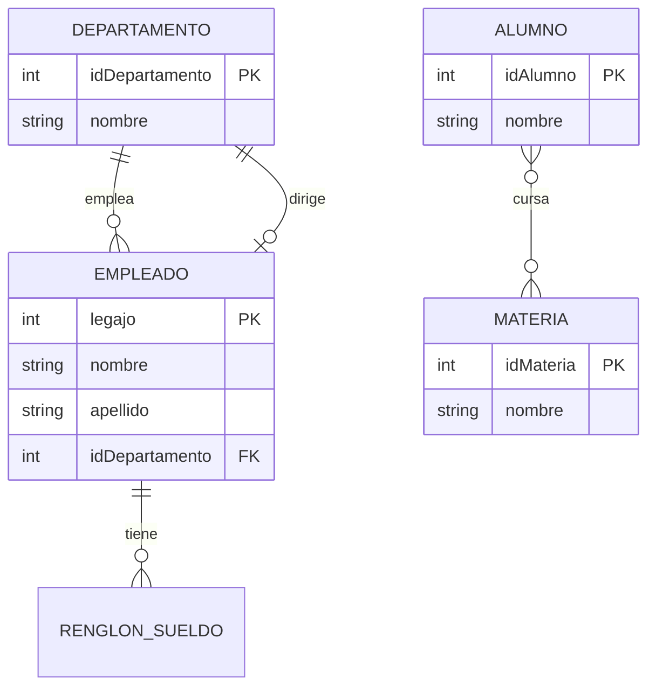

# Modelo Entidad-Relación

## 1. Motivación

En la segunda fase del diseño de una base de datos, el **diseño conceptual**,
que es construir un esquema conceptual a partir de los requerimientos
relevados, usando un modelo de datos de alto nivel, sin preocuparse todavía
por cómo se van a almacenar físicamente los datos. El **modelo
Entidad-Relación** (o modelo E-R), propuesto por Peter Chen en 1976, es el
modelo de alto nivel más usado para esa etapa.

Su objetivo es describir el "mini-mundo" (el universo del discurso que
interesa modelar) en términos cercanos a como lo percibe una persona: qué
**cosas** existen, qué **propiedades** tienen, y cómo se **relacionan** entre
sí. A diferencia del modelo relacional (que ya define tablas y claves
foráneas), el modelo E-R es puramente conceptual: no se traduce directamente a
ninguna estructura de almacenamiento, sino que sirve como paso intermedio,
fácil de validar con los usuarios, antes de pasar al diseño lógico.

Se lo suele representar gráficamente mediante un **diagrama Entidad-Relación**
(DER), lo cual facilita comunicarlo tanto a usuarios no técnicos como a
quienes luego lo van a traducir a un esquema relacional.

---

## 2. Entidades y conjuntos de entidades

Una **entidad** es un objeto del mundo real (concreto o abstracto) que se
puede distinguir de todos los demás. Por ejemplo, una persona, un producto, un
curso, o incluso un evento como "el préstamo de un libro" pueden ser entidades.

Un **conjunto de entidades** (_entity set_) agrupa entidades del mismo tipo,
es decir, que comparten las mismas propiedades (atributos). Por ejemplo, el
conjunto de entidades `Empleado` agrupa a todas las entidades "empleado" de la
organización. En un diagrama E-R, un conjunto de entidades se representa con
un **rectángulo**.

```{note} Nota
Es común, por simplicidad, hablar de "la entidad Empleado" para referirse en
realidad al *conjunto* de entidades Empleado.
```

---

## 3. Atributos

Los **atributos** son las propiedades que describen a las entidades de un
conjunto. Por ejemplo, `Empleado` podría tener los atributos `legajo`,
`nombre`, `apellido`, `fechaDeIngreso` y `sueldo`.

Según su estructura y comportamiento, los atributos se clasifican en:

- **Simples (o atómicos):** No se pueden dividir en partes más chicas (por
  ejemplo, `legajo`).
- **Compuestos:** Se descomponen en subpartes, cada una con su propio
  significado (por ejemplo, `direccion` podría descomponerse en `calle`,
  `numero`, `ciudad`).
- **Monovaluados:** La entidad tiene un único valor para ese atributo (por
  ejemplo, `fechaDeNacimiento`).
- **Multivaluados:** La entidad puede tener varios valores simultáneos para
  ese atributo (por ejemplo, `telefonos`, si una persona puede tener más de un
  teléfono). Se representan con un doble óvalo.
- **Derivados:** Su valor se puede calcular a partir de otros atributos o
  entidades, en lugar de almacenarse directamente (por ejemplo, `edad`,
  derivable de `fechaNacimiento`, o "cantidad de empleados de un
  departamento", derivable de contar las entidades `Empleado` relacionadas).
  Se representan con un óvalo punteado.

### 3.1. Atributo clave

Un **atributo clave** (o conjunto de atributos clave) es aquel cuyo valor
identifica de manera única a cada entidad dentro de su conjunto, no puede
haber dos entidades del mismo conjunto con el mismo valor de clave. Por
ejemplo, `legajo` es clave de `Empleado` si no hay dos empleados con el mismo
legajo. En el diagrama, el o los atributos clave se subrayan.

Esta noción es la contraparte, en el modelo E-R, de la clave primaria del
modelo relacional: "cada tabla representa los atributos de una entidad del
mundo real, y debe tener un elemento identificador".

---

## 4. Conjuntos de relaciones (_relationship sets_)

Una **relación** vincula dos o más entidades, en general de distintos
conjuntos. Un **conjunto de relaciones** agrupa relaciones del mismo tipo. Por
ejemplo, el conjunto de relaciones `TrabajaEn` podría vincular entidades
`Empleado` con entidades `Departamento`. En un diagrama E-R, un conjunto de
relaciones se representa con un **rombo**, unido mediante líneas a los
rectángulos de los conjuntos de entidades que participan.

### 4.1. Grado de una relación

El **grado** de un conjunto de relaciones es la cantidad de conjuntos de
entidades que participan en él:

- **Binaria (grado 2):** La más común. Por ejemplo, `Empleado —TrabajaEn—
Departamento`.
- **Ternaria (grado 3) o de grado mayor:** Vincula tres o más conjuntos de
  entidades a la vez. Por ejemplo, `Proveedor —Suministra— (Producto,
Proyecto)`: un proveedor suministra un producto para un proyecto
  determinado, y esa terna es la información atómica (no se puede descomponer
  sin perder información, si el precio o la cantidad dependen de los tres a la
  vez).

Un conjunto de relaciones también puede tener sus propios **atributos**. Por
ejemplo, `TrabajaEn` podría tener un atributo `fechaDeAsignacion`, que no
pertenece ni a `Empleado` ni a `Departamento`, sino específicamente al hecho
de que ese empleado trabaja en ese departamento.

### 4.2. Cardinalidad de una relación binaria

La **cardinalidad** (o razón de cardinalidad) describe cuántas entidades de un
conjunto pueden asociarse, a través de la relación, con entidades del otro
conjunto. Para una relación binaria entre $A$ y $B$, hay cuatro casos posibles:

| Cardinalidad              | Significado                                                                                                          | Ejemplo                                                                                                                          |
| ------------------------- | -------------------------------------------------------------------------------------------------------------------- | -------------------------------------------------------------------------------------------------------------------------------- |
| **1:1** (uno a uno)       | Cada entidad de $A$ se asocia con a lo sumo una de $B$, y viceversa.                                                 | `Persona —Dirige— Departamento` (un departamento tiene un único director, y una persona dirige a lo sumo un departamento).       |
| **1:N** (uno a muchos)    | Cada entidad de $A$ se puede asociar con varias de $B$, pero cada entidad de $B$ se asocia con a lo sumo una de $A$. | `Departamento —Emplea— Empleado` (un departamento tiene varios empleados, pero cada empleado pertenece a un único departamento). |
| **N:1** (muchos a uno)    | Es la misma situación que 1:N, mirada desde el otro lado.                                                            | `Empleado —Pertenece_a— Departamento`.                                                                                           |
| **N:M** (muchos a muchos) | Cada entidad de $A$ se puede asociar con varias de $B$, y cada entidad de $B$ con varias de $A$.                     | `Alumno —Cursa— Materia` (un alumno cursa varias materias, y una materia es cursada por varios alumnos).                         |

En el diagrama, la cardinalidad se suele anotar sobre las líneas que conectan
cada entidad con el rombo de la relación (notación de Chen: `1`, `N` o `M`
junto a la línea; notación "pata de gallo" o _crow's foot_: distintos símbolos
de bifurcación en el extremo de la línea).

### 4.3. Restricciones de participación

Además de la cardinalidad, interesa saber si **todas** las entidades de un
conjunto participan obligatoriamente en la relación, o solo algunas:

- **Participación total:** Toda entidad del conjunto participa en al menos una
  relación del conjunto de relaciones. Se representa con una línea doble entre
  la entidad y la relación. Por ejemplo, si todo empleado debe pertenecer a
  algún departamento, la participación de `Empleado` en `Pertenece_a` es total.
- **Participación parcial:** Puede haber entidades del conjunto que no
  participen en ninguna relación de ese tipo. Se representa con una línea
  simple. Por ejemplo, si no todos los departamentos tienen necesariamente un
  director asignado en un momento dado, la participación de `Departamento` en
  `Dirige` es parcial.

En conjunto, cardinalidad y participación se suelen expresar como pares
**(mínimo, máximo)** por cada lado de la relación (por ejemplo,
`Empleado (1,1) —Pertenece_a— (0,N) Departamento`), lo cual permite ser más
preciso que solo indicar 1:1, 1:N o N:M.

---

## 5. Entidades débiles

Una **entidad débil** es un conjunto de entidades que **no tiene atributos
propios suficientes para formar una clave:** depende de otro conjunto de
entidades (su **entidad fuerte** o _identifying entity_) para poder
identificarse unívocamente.

Por ejemplo, en `Factura —Contiene— Renglon`, un `Renglon` de factura puede
identificarse solo por su número de línea (`1`, `2`, `3`, ...) dentro de una
factura concreta, ese número se repite en todas las facturas. La clave real de
`Renglon` es la combinación de la clave de `Factura` (su **entidad fuerte**)
más su **clave parcial** (`numeroLinea`).

En el diagrama:

- El conjunto de entidades débil se dibuja con un **rectángulo de doble
  línea**.
- El conjunto de relaciones que lo vincula con su entidad fuerte (llamado
  **relación identificadora**) se dibuja con un **rombo de doble línea**.
- La clave parcial se subraya con una línea punteada (en vez de una línea
  sólida).
- La participación de la entidad débil en la relación identificadora es
  siempre **total** (no puede existir sin su entidad fuerte).

---

## 6. Jerarquías de generalización y especialización

- **Especialización:** Es el proceso de definir subconjuntos de un conjunto de
  entidades (llamado **superclase**), cada uno con atributos o relaciones
  propias que no aplican al resto. Por ejemplo, de `Empleado` (superclase) se
  pueden especializar `Ingeniero` y `Secretario` (subclases), cada una con
  atributos propios (`especialidad` para `Ingeniero`, `velocidadTipeo` para
  `Secretario`), además de heredar todos los atributos de `Empleado`.
- **Generalización:** Es el proceso inverso, a partir de varios conjuntos de
  entidades con atributos en común, se define una superclase que los agrupa.
  Por ejemplo, de `Auto` y `Camion` se puede generalizar `Vehiculo`.

En ambos casos se establece una relación **IS-A** ("es un") entre la subclase y
la superclase: todo `Ingeniero` es un `Empleado`. Las subclases **heredan**
todos los atributos y relaciones de la superclase, y pueden agregar los
propios.

Estas jerarquías se clasifican según dos criterios independientes:

- **Disjunción:** En una jerarquía **disjunta**, una entidad de la superclase
  pertenece a lo sumo a una subclase (por ejemplo, un empleado es Ingeniero
  _o_ Secretario, no ambos). En una jerarquía **superpuesta** (_overlapping_),
  una entidad puede pertenecer a varias subclases a la vez (por ejemplo, una
  persona puede ser `Estudiante` y `Empleado` simultáneamente).
- **Completitud:** En una jerarquía **total**, toda entidad de la superclase
  debe pertenecer a alguna subclase. En una jerarquía **parcial**, puede haber
  entidades de la superclase que no pertenezcan a ninguna subclase.

En el diagrama, la jerarquía se representa con un círculo (a veces etiquetado
`d` para disjunta o `o` para superpuesta) que conecta la superclase con sus
subclases mediante líneas hacia cada una, y con una línea doble desde la
superclase al círculo cuando la jerarquía es total.

---

## 7. Agregación

La **agregación** es el mecanismo que permite tratar un conjunto de relaciones
(junto con las entidades que participan en él) como si fuera, a su vez, una
entidad de orden superior, para poder relacionarlo con otro conjunto de
entidades.

El caso típico aparece cuando una relación ternaria en realidad esconde dos
relaciones binarias en cascada. Por ejemplo: `Empleado —TrabajaEn— Proyecto`
(un empleado trabaja en un proyecto), y esa combinación (empleado, proyecto) es
supervisada por un `Gerente`: `(Empleado, Proyecto) —Supervisado_por—
Gerente`. En vez de modelar una relación ternaria
`TrabajaEn_Supervisado(Empleado, Proyecto, Gerente)`, la agregación permite
tratar a `TrabajaEn` como una "caja" (una entidad compuesta) y relacionarla de
forma binaria con `Gerente`.

Este mecanismo es la contraparte, en el modelo E-R, de la relación **PART-OF**
("formado por") mencionada como mecanismo general de abstracción en [Modelo de
Datos 10.3](01-modelo-de-datos.md): la agregación arma una unidad de orden
superior a partir de una relación y sus participantes, del mismo modo en que
un `Auto` se arma agregando `Motor`, `Chasis`, etc.

---

## 8. Del modelo Entidad-Relación al modelo relacional

Una vez validado el esquema conceptual con los usuarios, el diseño lógico
consiste en traducirlo a tablas del modelo relacional. Las reglas de mapeo más
usadas son:

1. **Conjunto de entidades fuerte:** Una tabla, con una columna por cada
   atributo simple (los compuestos se "aplanan" en sus subpartes, y los
   multivaluados se llevan a una tabla aparte, ver punto 5). La clave de la
   entidad pasa a ser la **clave primaria** de la tabla.
2. **Conjunto de entidades débil:** Una tabla que incluye sus propios
  atributos, más los atributos de la clave primaria de su entidad fuerte (que
   además queda como **clave foránea**). La clave primaria de la tabla es la
   combinación de ambas.
3. **Relación $1:1$:** Se puede resolver agregando la clave primaria de una de
   las dos tablas como clave foránea en la otra (cualquiera de las dos, aunque
   conviene ponerla del lado con participación total, para evitar nulos), junto
   con los atributos propios de la relación, si tiene.
4. **Relación $1:N$ (o $N:1$):** Se agrega la clave primaria del lado "1" como
   clave foránea en la tabla del lado "N", junto con los atributos propios de
   la relación, si tiene. Por ejemplo, `Departamento —Emplea— Empleado` agrega
   `idDepartamento` como clave foránea en la tabla `Empleado`.
5. **Relación $N:M$:** Requiere una **tabla intermedia** propia, cuya clave
   primaria es la combinación de las claves primarias de ambos conjuntos de
   entidades (llevadas como claves foráneas), más los atributos propios de la
   relación, si tiene. Por ejemplo, `Alumno —Cursa— Materia` se traduce en una
   tabla `Cursa(idAlumno, idMateria, nota)`, con `idAlumno` y `idMateria` como
   claves foráneas.
6. **Atributo multivaluado:** Se traduce en una tabla aparte, con una columna
   para el valor del atributo y una clave foránea hacia la entidad dueña; la
   clave primaria de esa tabla es la combinación de ambas.
7. **Relación ternaria (o de grado mayor):** En general necesita su propia
   tabla, con una clave foránea por cada conjunto de entidades participante, y
   clave primaria formada por la combinación de todas ellas (salvo que la
   propia semántica del problema indique otra cosa).
8. **Jerarquías de generalización/especialización:** Admiten varias
   estrategias, entre ellas:
   - Una tabla para la superclase y una tabla por cada subclase, con clave
     primaria y foránea compartida (la de la subclase referencia a la de la
     superclase), la más flexible, y la más parecida al modelo E-R original.
   - Una única tabla para toda la jerarquía, con todos los atributos de todas
     las subclases (muchos de ellos nulos según el caso) y una columna
     discriminadora que indique a qué subclase pertenece cada fila.
   - Una tabla por subclase, sin tabla para la superclase, repitiendo en cada
     una los atributos heredados (solo recomendable si la jerarquía es
     disjunta y total).
9. **Agregación:** Se traduce igual que si la "entidad agregada" fuera una
   entidad fuerte más: su tabla ya incluye, por la regla 4 o 5, las claves
   foráneas de los conjuntos de entidades que agrega, y esa misma tabla se
   referencia como clave foránea desde la relación de orden superior.

```{note} Nota
Esta traducción es exactamente el "diseño lógico" (paso 4) de las fases de diseño de una base de datos que se describen en [Modelo de Datos 10.1](01-modelo-de-datos.md).
```

---

## 9. Ejemplo integrador

Un pequeño esquema para una facultad, que combina varios de los conceptos anteriores:



- `DEPARTAMENTO —emplea— EMPLEADO` es una relación 1:N con participación total
  del lado `EMPLEADO` (todo empleado pertenece a un departamento).
- `DEPARTAMENTO —dirige— EMPLEADO` es una relación 1:1, con participación
  parcial (no necesariamente todo departamento tiene director asignado).
- `ALUMNO —cursa— MATERIA` es una relación N:M, que en el modelo relacional se
  traduce en una tabla intermedia `Cursa(idAlumno, idMateria, ...)`.
