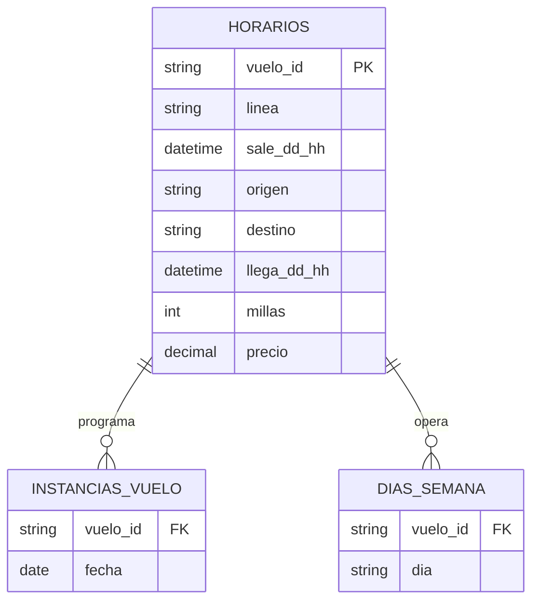

# SQL: Creación, actualización e integridad de la base de datos

## 1. Introducción

SQL (_Structured Query Language_) cubre, con un mismo lenguaje, las tres
funciones clásicas de un SGBD:

- **DDL (_Data Definition Language_):** `CREATE`, `ALTER`, `DROP`, define y
  modifica la estructura (el esquema) de la base de datos.
- **DML (_Data Manipulation Language_):** `INSERT`, `DELETE`, `UPDATE` (y
  `SELECT`, manipula los datos que viven dentro de esa estructura.
- **DCL (_Data Control Language_):** `GRANT`, `REVOKE`, controla permisos.

---

## 2. DDL — `CREATE TABLE`

```sql
-- Crear una tabla para pedidos.
CREATE TABLE pedidos (
  duenio_id    INTEGER NOT NULL,
  item_deseado CHAR(40) NOT NULL
);
```

Esta sentencia le da nombre a la tabla y le indica al SGBD todo lo necesario
sobre cada columna: su nombre, su tipo de dato, y si acepta valores nulos.

Los tipos de datos disponibles varían según el SGBD, pero los más comunes son:

| Tipo            | Descripción                                                                                                   |
| --------------- | ------------------------------------------------------------------------------------------------------------- |
| `CHAR(x)`       | Cadena de caracteres de longitud fija.                                                                        |
| `INTEGER`       | Número entero.                                                                                                |
| `DECIMAL(x, y)` | Número decimal con `x` dígitos totales e `y` decimales (por ejemplo, el máximo de `DECIMAL(4,2)` es `99.99`). |
| `DATE`          | Fecha.                                                                                                        |
| `LOGICAL`       | Booleano (verdadero/falso).                                                                                   |

**Sobre los valores `NULL`:**

- Si el valor de un atributo es **desconocido**, eso refleja que el atributo
  se aplica al caso pero su valor actual no se conoce, es una situación
  aceptable.
- Si el valor indica que el atributo **no se aplica** a ese caso, eso ya es un
  problema de diseño (probablemente el atributo debería estar en otra tabla).
- En ANSI SQL, `NULL` es distinto de cualquier otra cosa, incluso de otro
  `NULL`: comparar algo con `NULL` usando `=` siempre da como resultado
  `UNKNOWN` (por eso existe la cláusula `IS NULL`, y no `= NULL`).

### 2.1. Otras formas de `CREATE`

```sql
-- Crear una tabla a partir de otra (reingeniería).
CREATE TABLE personas AS (
  SELECT
    nombre,
    apellido
  FROM duenios
  WHERE duenio_id > 10
);

CREATE INDEX index_duenios_nombre ON duenios (apellido, nombre);

CREATE UNIQUE INDEX index_duenios_id ON duenios (duenio_id);

CREATE VIEW apellidos_nombres AS (
  SELECT apellido || ', ' || nombre AS apellido_nombre
  FROM duenios
);
```

Los lenguajes de consulta relacionales son **cerrados:** el resultado de una
consulta (_query_) es siempre otra relación. Una **vista** es justamente el
resultado de una consulta al que se le asigna un nombre, una relación
_snapshot_ que puede usarse en otras consultas y en la definición de otras
vistas. Las consultas sobre una vista se evalúan como una modificación de la
consulta que la define; algunas vistas son modificables (aceptan
`INSERT`/`UPDATE`/`DELETE`) y otras no.

### 2.2. `ALTER TABLE` / `DROP TABLE`

`ALTER TABLE` permite modificar la definición de una tabla ya creada: cambiar
el nombre de un atributo, cambiar su tipo, agregar o quitar atributos, agregar
o sacar restricciones de integridad, etc.

```sql
ALTER TABLE departamentos
ADD CONSTRAINT fk_departamentos_director
FOREIGN KEY (director_id) REFERENCES profesores (profesor_id)
ON DELETE SET NULL;
```

```sql
ALTER TABLE estudiantes
ADD promedio NUMERIC,
MODIFY status SET DEFAULT 'F';
```

El segundo ejemplo agrega el nuevo atributo `promedio` a la tabla
`estudiantes`, y modifica el valor por defecto del atributo `status` a `'F'`.

`DROP TABLE` elimina una tabla:

```sql
DROP TABLE estudiantes RESTRICT;
DROP TABLE estudiantes CASCADE;
```

- **`RESTRICT`:** La tabla solo se elimina si ningún otro componente del
  esquema hace referencia a ella.
- **`CASCADE`:** Además se eliminan todos los componentes del esquema que hacen
  referencia a esa tabla (por ejemplo, claves foráneas que apuntan a ella).

---

## 3. Constraints (restricciones de integridad)

Los _constraints_ expresan reglas que no se pueden capturar solo con la
estructura de las tablas. Por ejemplo, sobre un esquema de vuelos con
`horarios(vuelo_id, aerolinea, dia_de_semana, precio)` y
`vuelos_aeropuerto(vuelo_id, codigo_aeropuerto)`: _la partida debe ser antes
de la llegada_, _no puede llegar y salir del mismo aeropuerto_, _los aviones
solo pueden estar en un lugar a la vez_, _la sobreventa debe ser menor al 10
%_, etc.

Vale la pena distinguir dos ideas relacionadas:

- **Integridad:** El modelo refleja bien la realidad.
- **Consistencia:** El modelo no tiene conflictos internos.

**Tipos de constraints habituales:**

- _Primary keys_ (claves primarias).
- _Unique identifiers_ (identificadores únicos).
- _Foreign keys_ (claves foráneas, integridad referencial).
- _Checks_ (condiciones sobre valores).
- _Triggers_.
- _Stored procedures_.

### 3.1. Sintaxis genérica

La sintaxis exacta varía en cada SGBD, pero en general aparece así, dentro de
`CREATE TABLE` o de `ALTER TABLE`:

```sql
DEFAULT { valor | NULL } -- para columnas
PRIMARY KEY (columna_1 [, columna_2 ...])
FOREIGN KEY (columna_1 [, columna_2 ...])
  REFERENCES nombre_tabla [(columna_1 [, columna_2 ...])]
  [ON DELETE {CASCADE | SET DEFAULT | SET NULL}]
  [ON UPDATE {CASCADE | SET DEFAULT | SET NULL}]
CHECK (expresion_condicional)
```

- `ON DELETE` / `ON UPDATE` definen qué pasa con las filas que referencian a
  una fila borrada o modificada: `CASCADE` propaga el borrado/cambio, `SET
  DEFAULT` pone el valor por defecto, y `SET NULL` deja la referencia en
  `NULL`.

### 3.2. Ejemplos por SGBD

**Postgres** (claves primaria y foránea inline):

```sql
CREATE TABLE autores (
  publicacion_id INTEGER REFERENCES publicaciones (publicacion_id),
  escritor_id INTEGER REFERENCES escritores (escritor_id),
  PRIMARY KEY (publicacion_id, escritor_id)
);
```

**SQL Server** (constraints agregados con `ALTER TABLE`):

```sql
ALTER TABLE clientes
ADD CONSTRAINT pk_clientes PRIMARY KEY (cliente_id);

ALTER TABLE ordenes
ADD CONSTRAINT fk_ordenes_clientes FOREIGN KEY (cliente_id)
REFERENCES clientes (cliente_id);

ALTER TABLE contactos
ADD CONSTRAINT ck_contactos_telefono_valido
CHECK (telefono LIKE '[0-9][0-9][0-9] [0-9][0-9][0-9]-[0-9][0-9][0-9][0-9]');

ALTER TABLE empleados
ADD CONSTRAINT ck_empleados_fecha_nacimiento_valida
CHECK (fecha_nacimiento LIKE '%19[0-9][0-9]%' OR fecha_nacimiento LIKE '%200[0-2]%');

ALTER TABLE empleados
ADD CONSTRAINT ck_empleados_antiguedad_minima
CHECK (DATEDIFF(yyyy, fecha_nacimiento, fecha_contratacion) > 17);
```

> Por defecto, al crear o agregar un _check constraint_ se validan todos los
> valores ya existentes en la tabla, a menos que se use la palabra clave
> `WITH NOCHECK`.

**Informix** (_constraints_ con nombre, y a nivel de columna vs. a nivel de
)tabla:

```sql
ALTER TABLE clientes ADD CONSTRAINT UNIQUE (apellido, nombre);
ALTER TABLE clientes ADD CONSTRAINT UNIQUE (apellido, nombre) CONSTRAINT uq_clientes_apellido_nombre;

-- check constraints a nivel de columna
CREATE TABLE balances (
  balance_id SERIAL PRIMARY KEY,
  saldo_1    MONEY CHECK (saldo_1 BETWEEN 0 AND 99999),
  saldo_2    MONEY CHECK (saldo_2 BETWEEN 0 AND 99999)
);

-- check constraints a nivel de tabla (puede comparar entre columnas)
CREATE TABLE balances (
  balance_id SERIAL PRIMARY KEY,
  saldo_1    MONEY,
  saldo_2    MONEY,
  CHECK (saldo_1 > saldo_2)
);
```

**MySQL** (valor por defecto calculado):

```sql
CREATE TABLE eventos (
  evento_id  INT NOT NULL PRIMARY KEY AUTO_INCREMENT,
  dato       VARCHAR(100),
  creado_en  TIMESTAMP DEFAULT NOW()
);
```

**Oracle** (_constraint_ con nombre propio, y cómo deshabilitarlo):

```sql
CREATE TABLE proveedores (
  proveedor_id NUMERIC(4),
  nombre       VARCHAR2(50),
  CONSTRAINT ck_proveedores_id CHECK (proveedor_id BETWEEN 100 AND 9999)
);

ALTER TABLE proveedores DISABLE CONSTRAINT ck_proveedores_id;
```

### 3.3. DDL más avanzado, por SGBD

**Oracle** (_tablespaces_, y una tabla con columna encriptada y columna
calculada):

```sql
CREATE TABLESPACE tbs_perm_02
DATAFILE 'tbs_perm_02.dat' SIZE 10M
REUSE AUTOEXTEND ON NEXT 10M MAXSIZE 200M;
-- Si se omite DATAFILE, Oracle elige el datafile.

CREATE TABLE rrhh.empleados_admin (
  empleado_id   NUMBER(5) PRIMARY KEY,
  nombre        VARCHAR2(15) NOT NULL,
  dni           NUMBER(9) ENCRYPT,
  contratado_en DATE DEFAULT (sysdate),
  foto          BLOB,
  salario       NUMBER(7,2),
  tarifa_hora   NUMBER(7,2) GENERATED ALWAYS AS (salario / 2080),
  departamento_id NUMBER(3) NOT NULL
    CONSTRAINT fk_empleados_admin_departamento
    REFERENCES rrhh.departamentos (departamento_id)
)
TABLESPACE tbs_perm_02
STORAGE (INITIAL 50K);
```

**DB2** (columna autoincremental, y creación de tabla vacía a partir de otra):

```sql
CREATE TABLE contratistas (
  contratista_id INTEGER GENERATED ALWAYS AS IDENTITY,
  empleado_id    SMALLINT,
  nombre         CHAR(30),
  tarifa         DECIMAL(5,2)
)
IN dsnmain.tscorp;
-- Crea la tabla contratistas en el tablespace TSCORP de la base de datos
-- DSNMAIN.
-- contratista_id se incrementa automáticamente (empieza en 1 y
-- se incrementa en 1 por cada tupla nueva).

CREATE TABLE empleados_d11 AS (
  SELECT
    proyecto_id,
    nombre_proyecto,
    departamento_id
  FROM empleados
  WHERE departamento_id = 'D11'
)
WITH NO DATA;
```

### 3.4. `ALTER TABLE` / `DROP TABLE` (resumen)

- **`ALTER TABLE`:** Permite modificar la definición de la tabla.
  - Cambiar nombre de atributos.
  - Cambiar tipos de atributos.
  - Agregar o quitar atributos.
  - Agregar o quitar restricciones de integridad.
  - etc.
- **`DROP TABLE`:** Permite eliminar una tabla.

---

## 4. DML de actualización — `INSERT`, `DELETE`, `UPDATE`

Sobre el esquema:



### 4.1. `INSERT`

La forma más primitiva de `INSERT` respeta el orden exacto de las columnas del
esquema, sin nombrarlas:

```sql
INSERT INTO horarios
VALUES ('DL212', 'DELTA', '2000-11-15', 'ATL', 'CHI', '2000-11-13 05:00', 650, 351.00);
```

Si algún campo puede ser nulo, ese lugar debe llevar explícitamente el valor
`NULL` (algunas bases de datos aceptan `,,` y asumen nulo con eso).

También se pueden nombrar explícitamente las columnas que se van a completar:

```sql
INSERT INTO horarios (vuelo_id, linea) VALUES ('DL212', 'DELTA');
```

Acá se asume que los campos no nombrados pueden ser nulos, o tienen un valor
por defecto (_default_); como se usa el nombre de cada campo, el orden ya no
importa.

Un `INSERT` también puede tomar los valores del resultado de un `SELECT`, en
lugar de una lista literal. "Ingresar en la tabla `horarios` todos los vuelos
programados para el martes 9/10/2002":

```sql
INSERT INTO horarios (vuelo_id, sale_dd_hh)
SELECT
    iv.vuelo_id,
    DATE '2002-09-10'
FROM instancias_vuelo AS iv
INNER JOIN dias_semana AS ds
    ON iv.vuelo_id = ds.vuelo_id
WHERE ds.dia = 'MARTES';
```

Como hace falta un `SELECT` con dos tablas, en el `WHERE` (o en el `ON`) aparece
la condición de "join" sobre el campo que las relaciona, además de la condición
sobre el día.

### 4.2. `DELETE`

También tiene una sintaxis muy primitiva. "Borrar los vuelos programados para
el martes":

```sql
DELETE FROM dias_semana
WHERE dia = 'MARTES';
```

```{note} Nota
¿Se borran esos vuelos también de las otras tablas? Depende exclusivamente de
las restricciones de integridad referencial que se hayan definido (por ejemplo,
si la clave foránea tiene `ON DELETE CASCADE`, sí; si no, no).
```

### 4.3. `UPDATE`

"Cambiar los vuelos programados el martes para el viernes":

```sql
UPDATE dias_semana
SET dia = 'VIERNES'
WHERE dia = 'MARTES';
```

```{warning} Importante
Si un `UPDATE` (o un `DELETE`) no lleva `WHERE`, la operación se aplica a
**todas** las filas de la tabla.
```

---

## 5. Triggers y Stored Procedures

### 5.1. Triggers

Un **trigger** es un objeto de la base de datos que está "adosado" a una tabla:
a diferencia de un _stored procedure_, un trigger no se ejecuta porque alguien
lo invoque, sino que se dispara automáticamente cuando ocurre un `INSERT`,
`UPDATE` o `DELETE` sobre esa tabla. La(s) acción(es) que lo disparan se
especifican al crearlo.

**Ejemplo (sintaxis SQL Server)** donde mprime la hora del sistema cada vez que
se inserta una fila en `fuentes`:

```sql
CREATE TABLE fuentes (
    fuente_id   INT IDENTITY,
    descripcion VARCHAR(10)
);
GO

CREATE TRIGGER tr_fuentes_insert
ON fuentes
FOR INSERT
AS
    PRINT GETDATE();
GO

INSERT INTO fuentes (descripcion) VALUES ('Test 1');
-- Respuesta: despliega la fecha
```

**Sintaxis general (MySQL):**

```sql
[DEFINER = {user | CURRENT_USER}]
CREATE TRIGGER nombre_trigger
momento_disparo evento_disparo
ON nombre_tabla FOR EACH ROW
[orden_trigger]
cuerpo_trigger
```

- **`DEFINER`:** Usuario de la base de datos con privilegios para disparar el
  trigger (por defecto, quien lo crea).
- **`nombre_trigger`:** Nombre del trigger.
- **`momento_disparo`:** Si se ejecuta antes (`BEFORE`) o después (`AFTER`) del
  evento detectado.
- **`evento_disparo`:** El evento que lo activa — `INSERT`, `UPDATE` o `DELETE`.
- **`nombre_tabla`:** La tabla sobre la que se detecta el evento.
- **`orden_trigger`:** Si una tabla tiene varios triggers, por defecto se
  ejecutan en el orden en que fueron creados; se puede alterar ese orden con
  `FOLLOWS` (después de otro trigger) o `PRECEDES` (antes).
- **`cuerpo_trigger`:** El código que ejecuta el trigger.

### 5.2. Stored procedure con su trigger asociado

Ejemplo clásico: forzar que el `saldo` de las filas nuevas de `cuentas` nunca
sea negativo.

```sql
CREATE TABLE cuentas (
    numero_cuenta VARCHAR(10) NOT NULL,
    nombre_cliente VARCHAR(30) NOT NULL,
    tipo_cuenta   VARCHAR(15) NOT NULL,
    saldo         DECIMAL(10,2) NOT NULL WITH DEFAULT,
    PRIMARY KEY (numero_cuenta)
);
```

```txt
-- forzar_saldo_procedure
-- ----------------------------------------------------------------
-- Constraint : forzar que el saldo de las filas nuevas en cuentas
--              no sea negativo.
-- Event      : Insert en la tabla cuentas.
-- Action     : actualizar los valores de saldo negativos a cero.

store forzar_saldo_procedure procedure
  forzar_saldo_procedure static
  parameters
    string numero_cuenta
    number saldo
    sql handle cuenta_handle
  local variables
    number row_count
  actions
    on procedure startup
      begin
        call sqlconnect(cuenta_handle)
        call sqlprepare(cuenta_handle,
          'update cuentas
           set saldo = 0
           where numero_cuenta = :numero_cuenta')
      end
    on procedure execute
      begin
        if (saldo < 0)
          begin
            call sqlexecute(cuenta_handle)
            call sqlgetmodifiedrows(cuenta_handle, row_count)
            if (row_count <= 0)
              return 20001
          end
      end
    on procedure close
      begin
        call sqldisconnect(cuenta_handle)
      end
```

Y el trigger que dispara ese _stored procedure_ después de cada `INSERT`:

```txt
-- forzar_saldo_trigger
-- ----------------------------------------------------------------
-- Constraint : forzar que el saldo de las filas nuevas en cuentas
--              no sea negativo.
-- Event      : Insert en la tabla cuentas.
-- Action     : invocar al stored procedure forzar_saldo_procedure.

create trigger forzar_saldo_trigger
  after insert on cuentas
  for each row
  (execute forzar_saldo_procedure(cuentas.numero_cuenta, cuentas.saldo))
```

Este par (_trigger_ + _stored procedure_) es un buen ejemplo de una restricción
de integridad que es prácticamente imposible de expresar en el esquema mismo (no
hay forma de decir "todo `saldo` insertado debe ser $\geq 0$, y si no lo es,
corregirlo automáticamente" con `PRIMARY KEY`, `FOREIGN KEY` o `CHECK`), y que
en la práctica se resuelve con código activo dentro de la propia base de datos.
