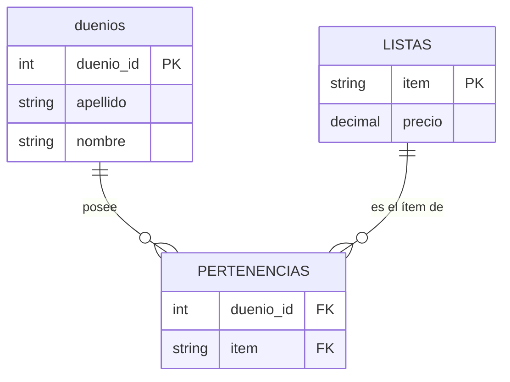
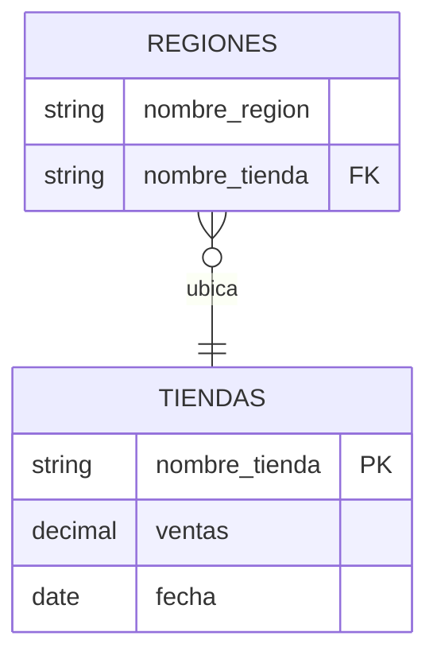
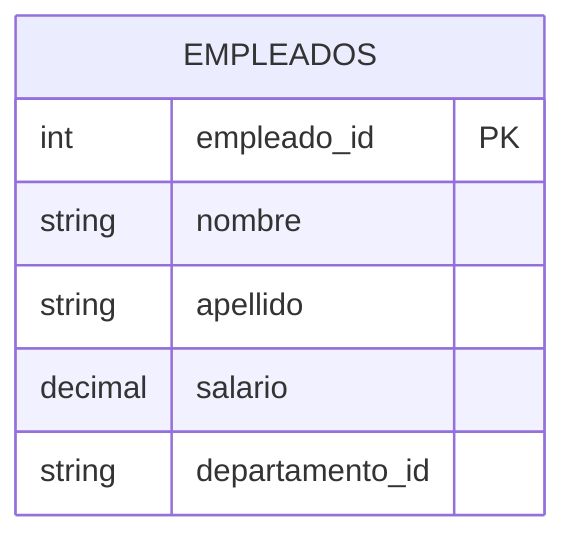

# SQL: Consultas

## 1. Historia de SQL

- SQL es un lenguaje **no procedural**: Se especifica _qué_ se quiere obtener,
  no _cómo_ obtenerlo. Opera sobre "conjuntos de tuplas" (multi-registro), no
  de a un registro por vez.
- **1972:** IBM (donde trabajaba Codd) usa las directrices de Codd para crear
  **SEQUEL** (_Structured English Query Language_). Más adelante se le asignaron
  las siglas **SQL** (_Structured Query Language_).
- **1979:** Oracle presenta la primera implementación comercial del lenguaje.
- **1986:** ANSI lo define como lenguaje estándar para los SGBD relacionales; un
  año después lo adopta ISO, y SQL se convierte en el estándar mundial de bases
  de datos relacionales.
- **1989:** SQL89 o SQL1, estándar ISO (y ANSI).
- **1992:** SQL92.
- **1999:** SQL99: incorpora _triggers_, procedimientos, funciones, y otras
  características propias de las bases de datos objeto-relacionales.
- **2011:** SQL2011.

## 2. Convenciones

- **Palabras clave** del lenguaje (`SELECT`, `FROM`, `WHERE`, `JOIN`, …) en
  **mayúsculas**.
- **Identificadores** (nombres de tablas, columnas, alias) en **minúsculas**,
  en `snake_case` (palabras separadas por guion bajo), y sin tildes ni `ñ`, para
  evitar problemas de portabilidad entre distintos SGBD y sistemas operativos.
- **Nombres de tabla en plural** (`duenios`, `pertenencias`, `listas`): Una
  tabla representa un _conjunto_ de filas.
- **Nombres de columna en singular** (`nombre`, `precio`), salvo que el valor
  sea intrínsecamente plural.
- Cada cláusula principal (`SELECT`, `FROM`, `WHERE`, `GROUP BY`, `HAVING`,
  `ORDER BY`) empieza en su propia línea; cuando una cláusula tiene varios
  elementos, se indenta con 4 espacios y se usa una coma **al final** de cada
  línea (nunca al principio).
- Los `JOIN` se escriben en su forma explícita (`JOIN ... ON ...`), salvo en
  los pocos casos en que el propio apunte compara esa forma con la sintaxis
  "clásica" (`FROM a, b WHERE ...`) a propósito.
- Toda columna, en una consulta con más de una tabla, se referencia con el
  alias de su tabla (`d.nombre`, no `nombre`), incluso cuando no sería
  estrictamente necesario, para que la consulta sea inequívoca a simple vista.

## 3. Tablas de ejemplo

La mayoría de los ejemplos de este apunte usan el siguiente esquema:



**`duenios`**

| duenio_id | apellido | nombre    |
| --------- | -------- | --------- |
| 01        | Jonas    | Guillermo |
| 02        | Sanchez  | Roberto   |
| 15        | Larson   | Patricia  |
| 21        | Akins    | Juana     |
| 50        | Forbes   | Santiago  |

**`pertenencias`**

| duenio_id | item       |
| -------- | ---------- |
| 02       | Mesa       |
| 02       | Escritorio |
| 21       | Silla      |
| 21       | Mesa       |
| 15       | Espejo     |

**`listas`**

| item       | precio |
| ---------- | ------ |
| Mesa       | 2000   |
| Escritorio | 3000   |
| Silla      | 1000   |
| Espejo     | 1500   |

## 4. `SELECT`: sintaxis básica

```sql
SELECT lista_de_atributos
FROM lista_de_tablas
WHERE condiciones;
```

**Listar los dueños (todas las columnas, con `*`):**

```sql
SELECT *
FROM duenios;
```

**Listar los dueños de nombre Juana** (todas las columnas por el `*`, pero solo
algunas filas por el `WHERE`):

```sql
SELECT *
FROM duenios
WHERE nombre = 'Juana';
```

Resultado:

| duenio_id | apellido | nombre |
| -------- | -------- | ------ |
| 21       | Akins    | Juana  |

- **Operadores entre campos:** `=`, `<>` o `!=` (distinto de), `<`, `>`, `<=`,
  `>=`.
- **Conectores lógicos:** `AND`, `OR`.

## 5. `JOIN`, aliases, `DISTINCT`

**Mostrar cada ítem junto con el apellido y nombre de su dueño** (alias de
tablas, lista de columnas):

```sql
-- forma clásica (JOIN implícito por WHERE)
SELECT
    d.apellido,
    d.nombre,
    p.item
FROM pertenencias AS p, duenios AS d
WHERE p.duenio_id = d.duenio_id;
```

```sql
-- forma equivalente con JOIN explícito (preferida)
SELECT
    d.apellido,
    d.nombre,
    p.item
FROM pertenencias AS p
JOIN duenios AS d
    ON p.duenio_id = d.duenio_id;
```

Resultado:

| apellido | nombre   | item       |
| -------- | -------- | ---------- |
| Sanchez  | Roberto  | Mesa       |
| Sanchez  | Roberto  | Escritorio |
| Akins    | Juana    | Silla      |
| Akins    | Juana    | Mesa       |
| Larson   | Patricia | Espejo     |

**Mostrar los nombres de quienes tienen algún ítem, sin repetirlos**
(`DISTINCT`; en algunos SGBD, `UNIQUE`):

```sql
SELECT DISTINCT
    d.apellido,
    d.nombre
FROM pertenencias AS p
JOIN duenios AS d
    ON p.duenio_id = d.duenio_id;
```

Resultado:

| apellido | nombre   |
| -------- | -------- |
| Sanchez  | Roberto  |
| Larson   | Patricia |
| Akins    | Juana    |

**Mostrar los nombres de todos los dueños que compraron mesas** (renombrar
columnas con `AS`, usar `AND`):

```sql
SELECT d.nombre AS nombre_comprador
FROM pertenencias AS p
JOIN duenios AS d
    ON p.duenio_id = d.duenio_id
WHERE p.item = 'Mesa';
```

Resultado:

| nombre_comprador |
| ---------------- |
| Roberto          |
| Juana            |

## 6. Subconsultas: `IN`, `NOT IN`, `MINUS`, `EXISTS`

**Usando `IN`, mostrar el nombre de quienes tienen sillas:**

```sql
SELECT d.nombre
FROM duenios AS d
WHERE d.duenio_id IN (
    SELECT p.duenio_id
    FROM pertenencias AS p
    WHERE p.item = 'Silla'
);
```

```{note} Nota
Después de `IN`, en lugar de un `SELECT`, también se puede poner directamente
una lista de valores (por ejemplo, `IN (2, 21)`).
```

**Mostrar los dueños que no tienen antigüedades:**

```sql
SELECT d.duenio_id
FROM duenios AS d
WHERE d.duenio_id NOT IN (
    SELECT p.duenio_id
    FROM pertenencias AS p
);
```

O también (menos usual):

```sql
SELECT d.duenio_id
FROM duenios AS d
MINUS
SELECT p.duenio_id
FROM pertenencias AS p;
```

**`EXISTS`** comprueba si el resultado de una consulta anidada es vacío: es
falso si el `SELECT` no devuelve ninguna fila, y verdadero si devuelve alguna.

**Listar los dueños que compraron sillas:**

```sql
SELECT
    d.nombre,
    d.apellido
FROM duenios AS d
WHERE EXISTS (
    SELECT 1
    FROM pertenencias AS p
    WHERE p.item = 'Silla' AND p.duenio_id = d.duenio_id
);
```

**Listar los ítems que no compró nadie:**

```sql
SELECT l.item
FROM listas AS l
WHERE NOT EXISTS (
    SELECT 1
    FROM pertenencias AS p
    WHERE p.item = l.item
);
```

## 7. `UNION` / `UNION ALL`

**Mostrar los ítems comprados por Juana, o que tengan precio mayor a 1000**
(`UNION` elimina duplicados; `UNION ALL` no):

```sql
SELECT p.item
FROM pertenencias AS p
JOIN duenios AS d
    ON p.duenio_id = d.duenio_id
WHERE d.nombre = 'Juana'
UNION
SELECT l.item
FROM listas AS l
WHERE l.precio > 1000;
```

## 8. `ORDER BY`

**Mostrar el nombre de quienes tienen sillas, ordenados en forma ascendente**
(revisar la sintaxis de `ASC` en cada SGBD):

```sql
SELECT d.nombre
FROM pertenencias AS p
JOIN duenios AS d
    ON p.duenio_id = d.duenio_id
WHERE p.item = 'Silla'
ORDER BY d.nombre ASC;
```

## 9. Operaciones y funciones de campo

**Mostrar los precios en dólares** (operación sobre un campo):

```sql
SELECT
    l.item,
    l.precio * 1.5 AS precio_dolares
FROM listas AS l;
```

**Mostrar el precio máximo** (función de campo):

```sql
SELECT MAX(l.precio) AS precio_maximo
FROM listas AS l;
```

**Contar los productos que compró Juana** (función de campo):

```sql
SELECT COUNT(p.item) AS cantidad_items
FROM pertenencias AS p
JOIN duenios AS d
    ON p.duenio_id = d.duenio_id
WHERE d.nombre = 'Juana';
```

### 9.1. Catálogo de funciones (varían según el SGBD)

**Funciones aritméticas simples:**

| Función               | Descripción                                               |
| --------------------- | --------------------------------------------------------- |
| `ABS(n)`              | Devuelve el valor absoluto de `n`.                        |
| `MOD(m, n)`           | Devuelve el resto de dividir `m` entre `n`.               |
| `POWER(m, exponente)` | Calcula la potencia de un número.                         |
| `ROUND(numero [, m])` | Redondea números con `m` dígitos de precisión.            |
| `SQRT(n)`             | Devuelve la raíz cuadrada de `n`.                         |
| `TRUNC(numero [, m])` | Trunca números a cierta cantidad de dígitos de precisión. |

**Funciones que devuelven valores numéricos:**

| Función       | Descripción                                                     |
| ------------- | --------------------------------------------------------------- |
| `ASCII(cad)`  | Devuelve el valor ASCII de la primera letra de la cadena `cad`. |
| `LENGTH(cad)` | Devuelve el número de caracteres de `cad`.                      |

**Funciones que devuelven valores de caracteres:**

| Función                                                | Descripción                                                                            |
| ------------------------------------------------------ | -------------------------------------------------------------------------------------- |
| `CONCAT(cad1, cad2)`                                   | Devuelve `cad1` concatenada con `cad2`.                                                |
| `LOWER(cad)`                                           | Devuelve `cad` en minúsculas.                                                          |
| `UPPER(cad)`                                           | Devuelve `cad` en mayúsculas.                                                          |
| `LPAD(cad1, n [, cad2])`                               | Añade caracteres a la izquierda hasta alcanzar longitud `n` (`RPAD` es a la derecha).  |
| `LTRIM(cad [, set])`                                   | Suprime un conjunto de caracteres a la izquierda de la cadena (`RTRIM`, a la derecha). |
| `REPLACE(cad, cadena_busqueda [, cadena_sustitucion])` | Sustituye caracteres de una cadena por otros (o por nada).                             |
| `SUBSTR(cad, m [, n])`                                 | Obtiene parte de una cadena.                                                           |

**Funciones para el manejo de fechas:**

| Función                          | Descripción                                                                            |
| -------------------------------- | -------------------------------------------------------------------------------------- |
| `SYSDATE`                        | Devuelve la fecha del sistema.                                                         |
| `MONTHS_BETWEEN(fecha1, fecha2)` | Devuelve la diferencia en meses entre `fecha1` y `fecha2`.                             |
| `NEXT_DAY(fecha, cad)`           | Devuelve la fecha del primer día de la semana indicado por `cad`, posterior a `fecha`. |

**Funciones de conversión:**

| Función                 | Descripción                                              |
| ----------------------- | -------------------------------------------------------- |
| `TO_CHAR`               | Transforma un `DATE` o `NUMBER` en cadena de caracteres. |
| `TO_DATE`               | Transforma un `NUMBER` o `CHAR` en `DATE`.               |
| `TO_NUMBER`             | Transforma una cadena de caracteres en `NUMBER`.         |
| `NVL(valor, expresión)` | Sustituye un valor nulo por otro valor.                  |

> En general, cada SGBD tiene funciones adicionales propias, con su propia
> sintaxis.

## 10. Patrones (`LIKE` / `MATCHES`), concatenación, `NULL`, autojoin

**Listar los dueños cuyos nombres empiezan con "J":**

```sql
SELECT *
FROM duenios AS d
WHERE d.nombre LIKE 'J%';
-- # para un número, ? para un solo carácter, "[a-h]" para un rango,
-- según el SGBD (esta variante usa la sintaxis más difundida, LIKE)
```

**Listar los dueños cuyos nombres tienen una "J" en algún lugar, en mayúscula o
minúscula:**

```sql
SELECT d.*
FROM duenios AS d
WHERE d.nombre LIKE '%[Jj]%';
```

**Listar nombre y apellido de los dueños para mailing** (concatenar literales y
columnas):

```sql
SELECT 'Señor/a ' || d.apellido || ', ' || d.nombre AS saludo
FROM duenios AS d;
```

**Listar los ítems que no tienen precio:**

```sql
SELECT l.*
FROM listas AS l
WHERE l.precio IS NULL;
```

**Listar los apellidos de los dueños que tienen el mismo nombre** (autojoin, la
tabla se une consigo misma):

```sql
SELECT
    a.apellido AS apellido_1,
    b.apellido AS apellido_2
FROM duenios AS a
JOIN duenios AS b
    ON a.nombre = b.nombre AND a.apellido < b.apellido;
-- la condición de "menor" evita que se repitan los mismos pares en otro orden
```

**Listar los ítems de menor precio:**

```sql
SELECT a.*
FROM listas AS a
WHERE a.precio = (
    SELECT MIN(b.precio)
    FROM listas AS b
);

-- o también:
SELECT a.*
FROM listas AS a
WHERE a.precio <= ALL (
    SELECT b.precio
    FROM listas AS b
);
-- (algunos SGBD soportan ALL / ANY y otros no)
```

## 11. `GROUP BY` / `HAVING` y funciones de grupo

**Contar cuántas antigüedades compró cada dueño:**

```sql
SELECT
    p.duenio_id,
    COUNT(p.item) AS cantidad_items
FROM pertenencias AS p
GROUP BY p.duenio_id;
```

- Los valores `NULL` en los campos de `GROUP BY` se agrupan y no se omiten, pero
  no se evalúan dentro de las funciones agregadas (por ejemplo, en `SUM`).
- **¿Cómo funciona?** Genera un grupo por cada valor distinto de `duenio_id`; de
  cada grupo devuelve el `duenio_id` y la cantidad de tuplas de ese grupo.
- Con `HAVING` se pueden especificar condiciones **sobre los grupos** (no sobre
  las filas individuales).

**Contar cuántas antigüedades compró cada dueño, solo si compró más de una:**

```sql
SELECT
    p.duenio_id,
    COUNT(p.item) AS cantidad_items
FROM pertenencias AS p
GROUP BY p.duenio_id
HAVING COUNT(p.item) > 1;
```

**Sintaxis general:**

```sql
SELECT
    alias.atributos,
    alias.agregados
FROM tablas AS alias
-- incluye las condiciones de JOIN, si hay más de una tabla
WHERE alias.condiciones_sobre_campos_o_funciones_de_campos
GROUP BY alias.atributos
HAVING alias.condiciones_sobre_agregados
ORDER BY
    alias.atributos,
    alias.agregados;
```

- `WHERE` excluye, **antes de agrupar**, las filas que no interesan, con
  condiciones sobre campos (o funciones de campos) de la tabla.
- `HAVING` filtra los registros **una vez agrupados**, con condiciones que solo
  pueden usar agregados.
- En el `GROUP BY` deben aparecer todos los campos del `SELECT` que no sean
  funciones de grupo (agregados).

**Funciones de grupo** (estándar, comunes a todos los SGBD):

| Función                 | Descripción                                                                                                        |
| ----------------------- | ------------------------------------------------------------------------------------------------------------------ |
| `AVG(n)`                | Calcula el valor medio de `n`, ignorando los valores nulos.                                                        |
| `COUNT(* \| expresión)` | Cuenta la cantidad de veces que la expresión evalúa un dato no nulo. Con `*` cuenta todas las filas seleccionadas. |
| `SUM(expresión)`        | Obtiene la suma de los valores de la expresión.                                                                    |
| `MAX(expresión)`        | Obtiene el máximo de los valores de la expresión.                                                                  |
| `MIN(expresión)`        | Obtiene el mínimo de los valores de la expresión.                                                                  |

> En general, cada SGBD tiene más funciones de grupo, con sintaxis propia.

**Aplicación interesante $\rightarrow$ listar los dueños duplicados:**

```sql
SELECT
    d.nombre,
    d.apellido
FROM duenios AS d
GROUP BY
    d.nombre,
    d.apellido
HAVING COUNT(d.*) > 1;
```

## 12. `OUTER JOIN`

**Tablas de ejemplo para esta sección:**



**`tiendas`**

| nombre_tienda | ventas | fecha      |
| ------------- | ------ | ---------- |
| Los Angeles   | 1500   | 1999-01-05 |
| San Diego     | 250    | 1999-01-07 |
| Los Angeles   | 300    | 1999-01-08 |
| Boston        | 700    | 1999-01-08 |

**`regiones`**

| nombre_region | nombre_tienda |
| ------------- | ------------- |
| East          | Boston        |
| East          | New York      |
| West          | Los Angeles   |
| West          | San Diego     |

**Calcular la suma de las ventas de todos los negocios** (sintaxis Oracle,
`(+)`):

```sql
SELECT
    r.nombre_tienda,
    SUM(t.ventas) AS total_ventas
FROM regiones AS r, tiendas AS t
WHERE r.nombre_tienda = t.nombre_tienda (+)
GROUP BY r.nombre_tienda;
```

Resultado (**OUTER JOIN**):

| nombre_tienda | total_ventas |
| ------------- | ------------ |
| Boston        | 700          |
| New York      | NULL         |
| Los Angeles   | 1800         |
| San Diego     | 250          |

> `New York` no está en `tiendas`, pero aparece igual, con `NULL` en
> `total_ventas`.

Resultado de un **JOIN normal (INNER JOIN):** Nueva York desaparece, porque no
tiene ventas registradas:

| nombre_tienda | total_ventas |
| ------------- | ------------ |
| Boston        | 700          |
| Los Angeles   | 1800         |
| San Diego     | 250          |

**En SQL Server**, en lugar del `(+)` de Oracle se usa `LEFT JOIN`: hace
coincidir los registros de una tabla (la izquierda) con los de otra (la
derecha); si un valor de la tabla izquierda no encuentra coincidencia en la
derecha, se genera una fila extra (una por cada valor no encontrado) con todos
los campos de la tabla derecha en `NULL`.

```sql
SELECT i.columnas
FROM tabla_izquierda AS i
LEFT JOIN tabla_derecha AS d
    ON condicion;
```

**Ejemplos (editoriales / libros):**

```sql
SELECT
    l.titulo,
    e.nombre
FROM editoriales AS e
LEFT JOIN libros AS l
    ON l.codigo_editorial = e.codigo;
```

> El resultado muestra el título y el nombre de la editorial. Las editoriales
> cuyo código no está presente en `libros` también aparecen, pero con `NULL` en
> el campo `titulo`. La tabla `editoriales` es la que se usa para localizar
> registros en `libros` (es la tabla "izquierda").

```sql
SELECT
    l.titulo,
    e.nombre
FROM libros AS l
LEFT JOIN editoriales AS e
    ON l.codigo_editorial = e.codigo;
```

> El resultado muestra el título del libro y el nombre de la editorial. Los
> títulos cuyo código de editorial no está presente en `editoriales` aparecen
> igual, pero con `NULL` en el campo `nombre`. Acá la tabla `libros` es la que
> se usa para localizar registros en la tabla de la derecha (`editoriales`).

## 13. `FULL JOIN`

```sql
SELECT
    l.titulo,
    e.nombre
FROM editoriales AS e
FULL JOIN libros AS l
    ON l.codigo_editorial = e.codigo;
```

```sql
SELECT
    l.titulo,
    e.nombre
FROM libros AS l
FULL JOIN editoriales AS e
    ON l.codigo_editorial = e.codigo;
```

- El resultado muestra el título de **todos** los libros y el nombre de
  **todas** las editoriales.
- Los títulos cuyo código de editorial no está en `editoriales` aparecen igual,
  con `NULL` en `nombre`.
- Las editoriales que no tienen libros también aparecen, con `NULL` en `titulo`.

## 14. `OUTER JOIN`, variantes con `WHERE` vs. condición en el `ON`

```sql
-- 1
SELECT
    t1.*,
    t2.columna_x
FROM tablas_1 AS t1
LEFT JOIN tablas_2 AS t2
    ON t1.columna_1 = t2.columna_1
WHERE t2.columna_3 = 'aaa';
```

```sql
-- 2
SELECT
    t1.*,
    t2.columna_x
FROM tablas_1 AS t1
LEFT JOIN tablas_2 AS t2
    ON t1.columna_1 = t2.columna_1 AND t2.columna_3 = 'aaa';
```

```{note} Nota
El filtro en el `WHERE` descarta filas después de resolver el JOIN externo,
mientras que en el `ON` se aplica antes, y eso cambia qué filas de `tablas_1`
sobreviven.
```

**Sintaxis Informix** (`OUTER`) y su equivalente con `JOIN`:

```sql
-- INFORMIX
SELECT
    t1.*,
    t2.aaa,
    t3.bbb
FROM tablas_1 t1 OUTER (tablas_2 t2, tablas_3 t3)
WHERE t1.c1 = t2.c1
AND t3.nnnn = t2.nnn;
```

```sql
-- equivalente con JOIN
SELECT
    t1.*,
    t2.aaa,
    t3.bbb
FROM tablas_1 AS t1
LEFT JOIN tablas_2 AS t2
    ON t1.columna_1 = t2.columna_1
INNER JOIN tablas_3 AS t3
    ON t2.columna_2 = t3.columna_2;
```

> Trae todo `tablas_1`, y si `t2.c1 = t1.c1` trae la fila del join común
> (`INNER`) entre `tablas_2` y `tablas_3`; si en el resultado no existe la fila
> con `t2.nnn = t3.nnn`, deja `t2.aaa` y `t3.bbb` en `NULL`.

```sql
-- INFORMIX
SELECT
    t1.*,
    t2.aaa,
    t3.bbb
FROM tablas_1 AS t1, tablas_2 AS t2, OUTER tablas_3 AS t3
WHERE t1.c1 = t2.c1
AND t3.nnnn = t2.nnn;
```

```sql
-- equivalente con JOIN
SELECT
    t1.*,
    t2.aaa,
    t3.bbb
FROM tablas_1 AS t1
INNER JOIN tablas_2 AS t2
    ON t1.columna_1 = t2.columna_1
LEFT JOIN tablas_3 AS t3
    ON t2.columna_2 = t3.columna_2;
```

> Hace el JOIN común entre `tablas_1` y `tablas_2` (puede no traer todas las
> filas de esas tablas), y a esas filas del resultado, si existe `t3.nnnn =
> t2.nnnn`, les agrega `t3.bbb`; si no, lo deja en `NULL`.

**Tres variantes combinadas:**

```sql
-- 1
SELECT
    t1.*,
    t2.aaa,
    t3.bbb
FROM tablas_1 AS t1
LEFT JOIN tablas_2 AS t2
    ON t1.columna_1 = t2.columna_1
INNER JOIN tablas_3 AS t3
    ON t2.columna_2 = t3.columna_2;
```

```sql
-- 2
SELECT
    t1.*,
    t2.aaa,
    t3.bbb
FROM tablas_1 AS t1
INNER JOIN tablas_2 AS t2
    ON t1.columna_1 = t2.columna_1
LEFT JOIN tablas_3 AS t3
    ON t2.columna_2 = t3.columna_2;
```

```sql
-- 3
SELECT
    t1.*,
    t2.aaa,
    t3.bbb
FROM tablas_1 AS t1
LEFT JOIN tablas_2 AS t2
    ON t1.columna_1 = t2.columna_1
LEFT JOIN tablas_3 AS t3
    ON t2.columna_2 = t3.columna_2;
```

## 15. SQL avanzado - `CASE` (ejemplo DB2)



```sql
SELECT
    e.empleado_id,
    e.nombre,
    e.apellido,
    CASE
        WHEN e.salario < 25000 THEN 'BAJO'
        WHEN e.salario BETWEEN 25000 AND 30000 THEN 'NORMAL'
        WHEN e.salario > 30000 THEN 'ALTO'
        ELSE NULL
    END AS categoria_ingreso
FROM empleados AS e
WHERE e.departamento_id = 'D11';
```

```sql
SELECT
    e.apellido,
    e.salario,
    CASE
        WHEN e.salario >= 30000 THEN e.salario - 30000
        ELSE 30000 - e.salario
    END AS diferencia
FROM empleados AS e
WHERE e.departamento_id = 'D11'
ORDER BY e.diferencia;
```
