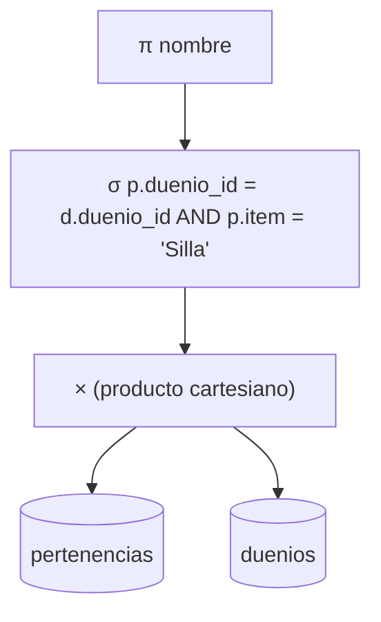
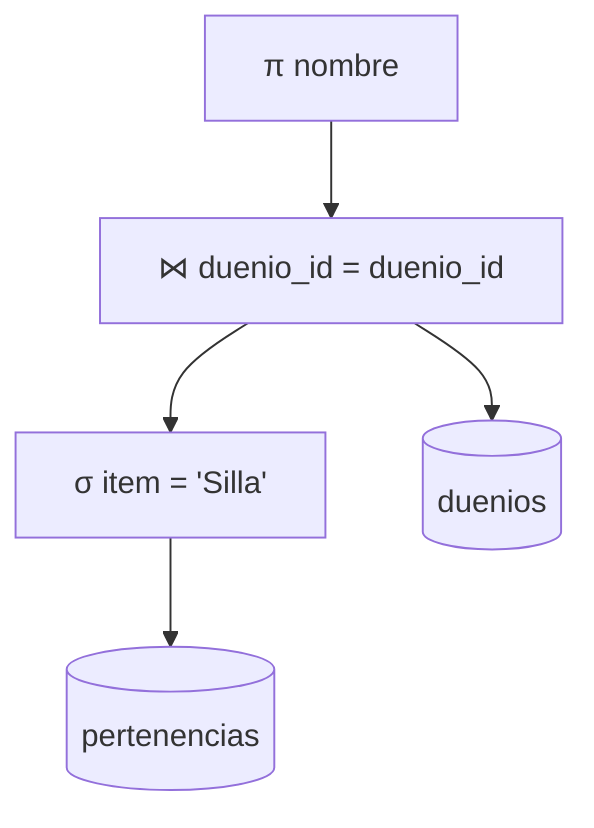

# Nociones de Álgebra Relacional y Optimización

## 1. Introducción

El modelo relacional tiene dos formas equivalentes de expresar sus operaciones:

- El **álgebra relacional**, un lenguaje **procedural:** cada consulta se
  escribe como una secuencia de operaciones sobre relaciones, y esa secuencia
  determina (al menos conceptualmente) _cómo_ se calcula el resultado.
- El **cálculo relacional**, un lenguaje **declarativo** (no procedural): la
  consulta describe _qué_ se quiere obtener, sin indicar los pasos para
  calcularlo.

Ambos son formalismos matemáticos equivalentes en poder expresivo (todo lo que
se puede expresar en uno se puede expresar en el otro), y sirven como base
teórica de los lenguajes de consulta reales. SQL, en particular, es
fundamentalmente un lenguaje declarativo (más cercano al cálculo relacional en
su formulación), pero **internamente**, cuando un SGBD ejecuta una sentencia
SQL, la traduce a una secuencia de operaciones de álgebra relacional (un **plan
de ejecución**), que es, precisamente, lo que un **optimizador de consultas**
intenta elegir de la forma más eficiente posible. Por eso entender el álgebra
relacional ayuda a entender qué hace realmente el SGBD por debajo de un
`SELECT`, y por qué una misma consulta escrita de dos formas puede ejecutarse
con muy distinto rendimiento.

Todas las operaciones del álgebra relacional toman una o más relaciones como
entrada y devuelven **otra relación** como salida (la misma propiedad de
"clausura"). Esto es lo que permite **componer** operaciones, anidando el
resultado de una como entrada de la siguiente.

---

## 2. Operadores unarios (sobre una única relación)

### 2.1. Selección ($\sigma$)

Selecciona las **tuplas** (filas) de una relación que cumplen una condición,
sin modificar sus atributos (columnas).

$$
\sigma_{\text{condición}}(R)
$$

Ejemplo con los dueños de apellido `'Sanchez'`:

$$
\sigma_{\text{apellido = 'Sanchez'}}(\text{duenios})
$$

Equivalente en SQL:

```sql
SELECT d.*
FROM duenios AS d
WHERE d.apellido = 'Sanchez';
```

La condición puede combinar varios predicados con $\land$ (AND), $\lor$ (OR) y
$\lnot$ (NOT), igual que el `WHERE` de SQL.

### 2.2. Proyección ($\pi$)

Selecciona **columnas** de una relación, descartando el resto, y elimina las
filas duplicadas que puedan resultar (porque el resultado del álgebra relacional
es siempre un _conjunto_ de tuplas).

$$
\pi_{\text{atributos}}(R)
$$

Ejemplo con los apellidos y nombres de los dueños, sin repetidos:

$$
\pi_{\text{apellido, nombre}}(\text{duenios})
$$

Equivalente en SQL:

```sql
SELECT DISTINCT
    d.apellido,
    d.nombre
FROM duenios AS d;
```

```{note} Nota
Esta es la razón formal por la que hace falta pedir `DISTINCT` de forma
explícita: SQL, a diferencia del álgebra relacional "pura", no elimina
duplicados por defecto (trabaja con multiconjuntos, por razones de eficiencia),
así que agregarlo es necesario para replicar el comportamiento de $\pi$.
```

### 2.3. Renombre ($\rho$)

Le da un nombre (a la relación completa y/o a sus atributos) al resultado de una
expresión, para poder referenciarlo o para poder combinarlo con otra relación
con nombres en conflicto (por ejemplo, en un autojoin).

$$
\rho_{S(B_1, \ldots, B_n)}(R)
$$

renombra la relación $R$ como $S$, y sus atributos como $B_1, \ldots, B_n$. Es
el equivalente formal del alias de tabla (`AS`).

---

## 3. Operadores de conjuntos

Estas operaciones provienen directamente de la teoría de conjuntos, y requieren
que las dos relaciones involucradas sean **compatibles respecto de la unión:**
deben tener el mismo número de atributos, y los atributos correspondientes deben
tener el mismo dominio.

| Operación    | Notación   | Equivalente SQL    | Descripción                                    |
| ------------ | ---------- | ------------------ | ---------------------------------------------- |
| Unión        | $R \cup S$ | `UNION`            | Tuplas que están en $R$, en $S$, o en ambas.   |
| Intersección | $R \cap S$ | `INTERSECT`        | Tuplas que están en $R$ **y** en $S$ a la vez. |
| Diferencia   | $R - S$    | `MINUS` / `EXCEPT` | Tuplas que están en $R$ pero **no** en $S$.    |

Ejemplo con `UNION` ("los ítems comprados por Juana, o que tengan precio mayor
a 1000"):

$$
\pi_{\text{item}}\big(\sigma_{\text{nombre = 'Juana'}}(\text{pertenencias} \bowtie \text{duenios})\big) \ \cup\ \pi_{\text{item}}\big(\sigma_{\text{precio > 1000}}(\text{listas})\big)
$$

Y con `MINUS` ("los dueños que no tienen antigüedades"):

$$
\pi_{\text{dueno\_id}}(\text{duenios}) - \pi_{\text{dueno\_id}}(\text{pertenencias})
$$

### 3.1. Producto cartesiano ($\times$)

A diferencia de las tres anteriores, el **producto cartesiano** no requiere que
las relaciones sean compatibles: combina **cada** tupla de $R$ con **cada**
tupla de $S$, sin ningún filtro. Si $R$ tiene $n$ tuplas y $S$ tiene $m$, el
resultado tiene $n \times m$ tuplas, con todos los atributos de ambas.

$$
R \times S
$$

Por sí solo casi nunca es útil: sirve como base para construir el `JOIN`,
combinándolo con una selección (ver más abajo).

---

## 4. Join (combinación de relaciones)

### 4.1. Theta-join y equi-join

El **theta-join** ($\theta$-join) combina el producto cartesiano con una
selección, en un solo paso:

$$
R \bowtie_{\theta} S \ \equiv\ \sigma_{\theta}(R \times S)
$$

donde $\theta$ es cualquier condición de comparación entre atributos de $R$ y de
$S$. Cuando $\theta$ es específicamente una igualdad, se lo llama
**equi-join**. Este es exactamente el mecanismo detrás de la "forma clásica" de
`JOIN`:

```sql
SELECT
    d.apellido,
    d.nombre,
    p.item
FROM pertenencias AS p, duenios AS d
WHERE p.duenio_id = d.duenio_id;
```

es, en álgebra relacional:

$$
\pi_{\text{apellido, nombre, item}}\big(\sigma_{\text{p.dueno\_id = d.dueno\_id}}(\text{pertenencias} \times \text{duenios})\big)
$$

es decir: producto cartesiano (todas las combinaciones posibles) seguido de una
selección que descarta las combinaciones donde los `duenio_id` no coinciden, y
eso es, precisamente, lo que hace un equi-join.

### 4.2. Join natural ($\bowtie$)

El **join natural** es un equi-join "automático": compara por igualdad todos los
atributos que $R$ y $S$ tienen en común (por nombre), y además **elimina las
columnas duplicadas** del resultado (a diferencia del equi-join genérico, que
las conserva a ambas).

$$
R \bowtie S
$$

Es el que corresponde a la forma con `JOIN` explícito (sin repetir la condición
dos veces) cuando los nombres de columna coinciden:

```sql
SELECT
    d.apellido,
    d.nombre,
    p.item
FROM pertenencias AS p
JOIN duenios AS d
    ON p.duenio_id = d.duenio_id;
```

### 4.3. Outer joins en álgebra relacional

Los `LEFT JOIN`, `RIGHT JOIN` y `FULL JOIN` tienen su propia notación en álgebra
relacional extendida:

| SQL          | Álgebra relacional | Conserva sin pareja a...                                       |
| ------------ | ------------------ | -------------------------------------------------------------- |
| `LEFT JOIN`  | `R ⟕ S`            | las tuplas de $R$ (rellenando con `NULL` los atributos de $S$) |
| `RIGHT JOIN` | `R ⟖ S`            | las tuplas de $S$ (rellenando con `NULL` los atributos de $R$) |
| `FULL JOIN`  | `R ⟗ S`            | las tuplas de ambos lados                                      |

### 4.4. División ($\div$)

La **división** es un operador derivado, menos frecuente que los anteriores,
pero clásico en los cursos de álgebra relacional porque no tiene una traducción
directa y simple a SQL. Responde a consultas del tipo "encontrar las entidades
de $R$ asociadas con **todos** los valores de $S$" (una cuantificación
universal).

Por ejemplo, sobre `pertenencias(duenio_id, item)` y una relación
`todos_los_items(item)` con todos los ítems del negocio, "los dueños que tienen
**todos** los ítems del negocio" es:

$$
\pi_{\text{dueno\_id, item}}(\text{pertenencias}) \div \text{todos\_los\_items}
$$

En SQL, este tipo de consulta se suele resolver con una doble negación (`NOT
EXISTS` anidado dos veces): "no existe ningún ítem que el dueño **no** tenga".

---

## 5. De SQL al árbol de consultas

Cuando el SGBD recibe una sentencia SQL, el **compilador/procesador de
consultas** la traduce a una expresión de álgebra relacional, y esa expresión se
representa internamente como un **árbol de consultas** (_query tree_): los nodos
hoja son las relaciones (tablas) involucradas, los nodos internos son operadores
del álgebra relacional, y la raíz representa el resultado final. Evaluar el
árbol de abajo hacia arriba (hoja por hoja) es, en esencia, ejecutar la
consulta.

Por ejemplo, la consulta "los nombres de los que tienen sillas, ordenados":

```sql
SELECT d.nombre
FROM pertenencias AS p, duenios AS d
WHERE p.duenio_id = d.duenio_id AND p.item = 'Silla'
ORDER BY d.nombre ASC;
```

se puede representar, de forma directa (sin optimizar todavía), como:



Un mismo resultado final se puede obtener con **muchos** árboles de consulta
distintos, es decir, muchas secuencias distintas de operaciones de álgebra
relacional, y ahí es donde entra la optimización.

---

## 6. Nociones de optimización de consultas

### 6.1. ¿Por qué hace falta optimizar?

SQL es un lenguaje **no procedural:** quien escribe la consulta dice _qué_
quiere, no _cómo_ obtenerlo. Eso es cómodo para quien programa, pero significa
que es el SGBD quien tiene que decidir, en tiempo de ejecución, **cómo** va a
calcular el resultado, y esa decisión puede tener un impacto enorme en el
rendimiento, sobre todo cuando las tablas son grandes y el costo dominante es
el de acceso a disco (E/S).

El árbol del ejemplo anterior, tomado literalmente, calcularía primero el
producto cartesiano **completo** entre `pertenencias` y `duenios` (multiplicando
la cantidad de filas de una por la cantidad de filas de la otra) y recién
después filtraría por la condición de igualdad, desperdiciando muchísimo
trabajo en construir combinaciones que después se van a descartar.

### 6.2. Heurísticas clásicas de optimización

Un **optimizador de consultas** aplica un conjunto de reglas de transformación
que producen árboles de consulta **equivalentes** (mismo resultado) pero más
baratos de evaluar. Las más conocidas:

- **Empujar las selecciones hacia las hojas ("_push down selections_"):**
  Aplicar cada $\sigma$ lo antes posible, sobre la relación base, en lugar de
  dejarla para el final. Cuantas menos filas "sobrevivan" desde temprano, menos
  trabajo hace falta después.
- **Empujar las proyecciones hacia las hojas:** Quedarse solo con las columnas
  que hacen falta lo antes posible, para reducir el tamaño de las tuplas que
  circulan por el resto del árbol.
- **Reemplazar producto cartesiano + selección por un JOIN:** Un
  $\sigma_\theta(R \times S)$ es equivalente a $R \bowtie_\theta S$, pero un
  SGBD puede evaluar un JOIN con algoritmos mucho más eficientes que "producto
  cartesiano completo y después filtrar" (por ejemplo, _hash join_ o _merge
  join_, que ni siquiera llegan a generar todas las combinaciones posibles).
- **Elegir un buen orden de evaluación de los JOINs**, cuando hay más de dos
   tablas: el resultado final es el mismo sin importar el orden (el JOIN es
  asociativo y conmutativo), pero el tamaño de los resultados **intermedios**
  puede variar muchísimo según qué se combine primero.
- **Usar índices** cuando existan y la condición lo permita (por ejemplo, una
  igualdad sobre una columna indexada), en lugar de recorrer la tabla entera
  (_full scan_).

Aplicando estas heurísticas, el árbol del ejemplo anterior se reescribe como:



Acá la selección `item = 'Silla'` ya se aplicó sobre `pertenencias` antes de
combinarla con `duenios`, así que el JOIN solo tiene que procesar las filas de
`pertenencias` que efectivamente corresponden a sillas, normalmente muchas menos
que la tabla completa.

### 6.3. Optimización basada en costos

Además de las heurísticas anteriores (que reescriben el árbol siguiendo reglas
fijas, sin mirar los datos), los SGBD modernos usan **optimizadores basados en
costos:** a partir de las estadísticas que mantiene el catálogo del sistema
(cantidad de filas por tabla, distribución de valores, índices existentes), el
optimizador estima el costo de **varios** planes de ejecución alternativos
(equivalentes entre sí) y elige el más barato antes de ejecutar la consulta. Es
exactamente la misma idea que "vigilancia del rendimiento" mencionada como
utilería del SGBD, pero aplicada de forma automática, consulta por consulta.
