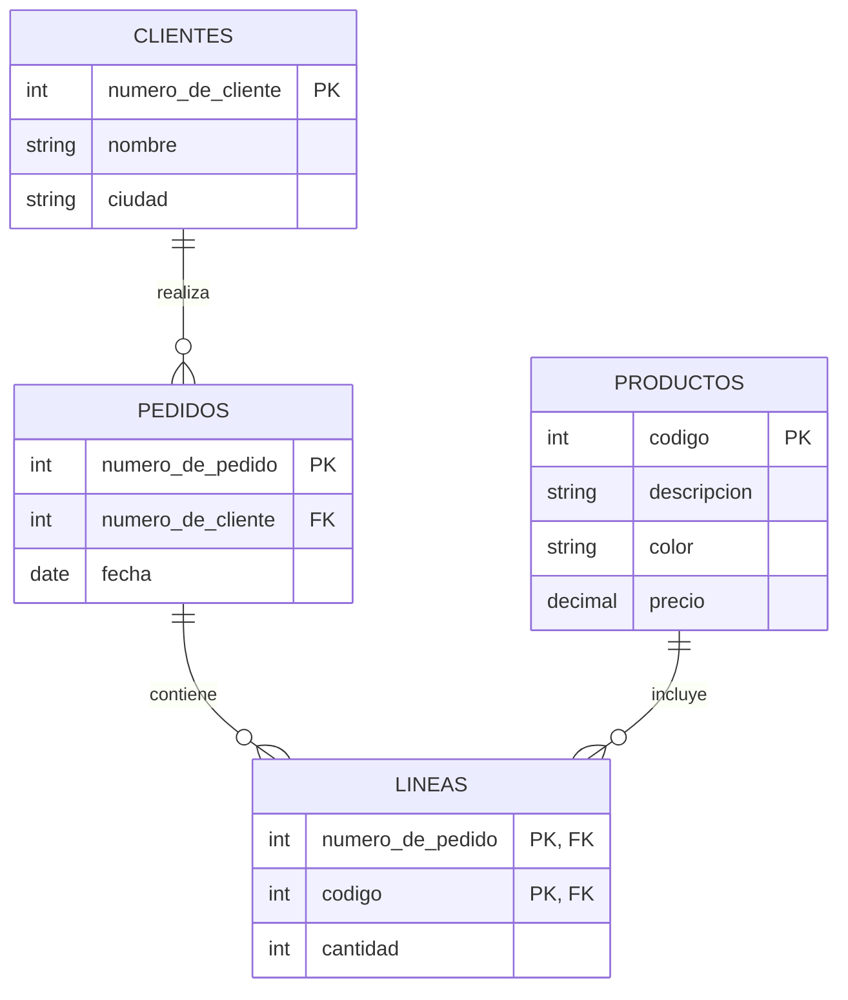

# Ejercicio 1

## Esquema de tablas

```text
clientes(numero_de_cliente, nombre, ciudad)
productos(codigo, descripcion, color, precio)
pedidos(numero_de_pedido, numero_de_cliente, fecha)
lineas(numero_de_pedido, codigo, cantidad)
```

## Diagrama entidad-relación



## Consignas

**1.** Listar la descripción de los productos que fueron pedidos por algún
cliente de Rosario.

```{literalinclude} ejercicio-1-1.sql
```

**2.** Listar los nombres de los clientes y, para cada cliente, el monto
total facturado (precio × cantidad) a partir del 10 de mayo de 1996, siempre
que este monto supere los $1000.

```{literalinclude} ejercicio-1-2.sql
```

**3.** Listar el nombre de los clientes que no compraron nada hoy.

```{literalinclude} ejercicio-1-3.sql
```

**4.** Mostrar la descripción de los productos que se pidieron en la última
semana.

```{literalinclude} ejercicio-1-4.sql
```

**5.** Calcular la cantidad de colores distintos en los que el cliente de
nombre "Pepe" pidió el producto de código 5.

```{literalinclude} ejercicio-1-5.sql
```
