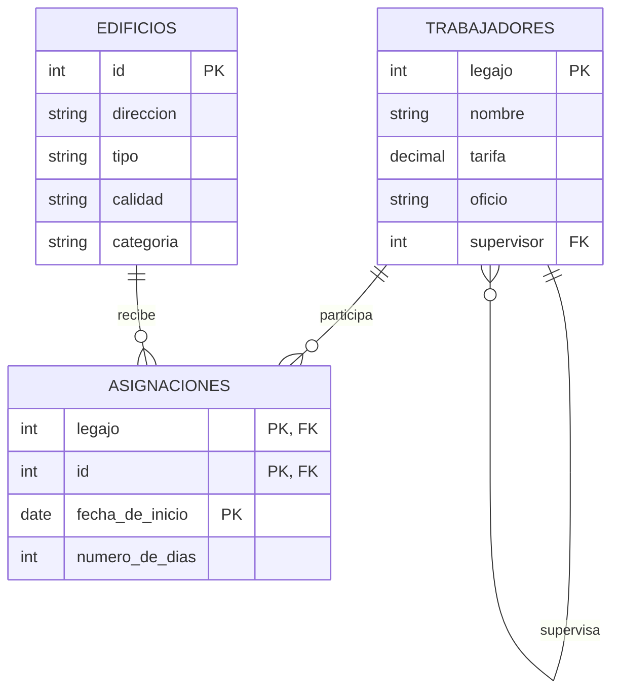

# Ejercicio 2

## Esquema de tablas

```text
trabajadores(legajo, nombre, tarifa, oficio, supervisor)
edificios(id, direccion, tipo, calidad, categoria)
asignaciones(legajo, id, fecha_de_inicio, numero_de_dias)
```

## Diagrama entidad-relación



> Nota: en el enunciado original, `trabajadores` tenía el atributo `legajo`
> repetido (una vez como clave primaria y otra como referencia al
> supervisor); se renombró el segundo caso a `supervisor`, quedando como una
> auto-referencia a `trabajadores.legajo`.

## Consignas

**1.** ¿Cuáles son los oficios de los trabajadores asignados al edificio
435?

```{literalinclude} ejercicio-2-1.sql
```

**2.** Indicar el nombre del trabajador y el de su supervisor.

```{literalinclude} ejercicio-2-2.sql
```

**3.** Listar el nombre de los trabajadores que no están asignados a ningún
edificio cuya categoría sea "oficina". *(se agregó el verbo faltante y se
aclaró que "oficina" es un valor del campo `categoria`)*

```{literalinclude} ejercicio-2-3.sql
```

**4.** Listar los nombres de los trabajadores que reciben una tarifa por
hora mayor que la de su supervisor.

```{literalinclude} ejercicio-2-4.sql
```

**5.** ¿Cuál es el número total de días que se dedicaron a la plomería en
el edificio 312?

```{literalinclude} ejercicio-2-5.sql
```
