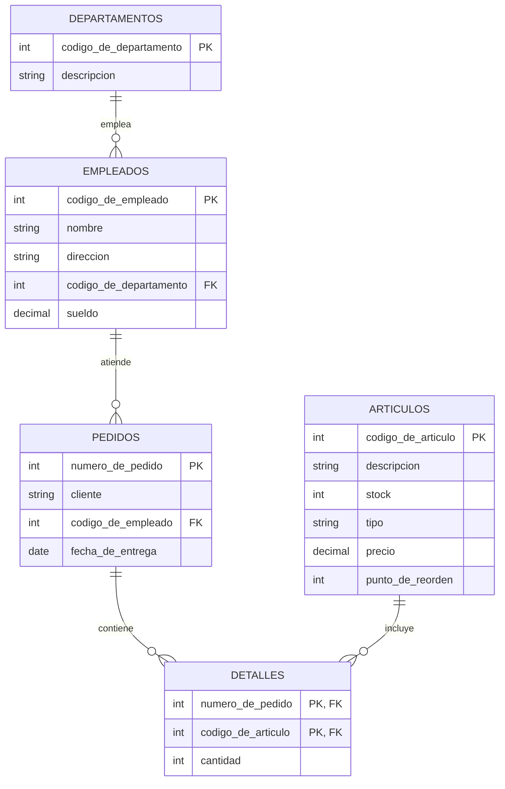

# Ejercicio 3

## Esquema de tablas

```text
empleados(codigo_de_empleado, nombre, direccion, codigo_de_departamento, sueldo)
departamentos(codigo_de_departamento, descripcion)
articulos(codigo_de_articulo, descripcion, stock, tipo, precio, punto_de_reorden)
pedidos(numero_de_pedido, cliente, codigo_de_empleado, fecha_de_entrega)
detalles(numero_de_pedido, codigo_de_articulo, cantidad)
```

## Diagrama entidad-relación



> Nota: `pedidos.cliente` es solo un dato textual (no hay tabla `clientes`
> en este ejercicio), por eso no aparece como relación en el diagrama.

> Nota: "pendiente de entrega" se interpreta como un pedido cuya
> `fecha_de_entrega` todavía no llegó (`fecha_de_entrega > CURRENT_DATE`),
> ya que el esquema no tiene una columna de fecha de pedido ni un flag de
> estado. Este criterio se usa de forma consistente en las consignas 6, 8 y
> 12.

## Consignas

**1.** Listar todos los datos de los artículos que se encuentren a menos de
un 10 % de su punto de reorden.

```{literalinclude} ejercicio-3-1.sql
```

**2.** Recuperar el total de sueldos y el promedio de sueldos para cada
departamento.

```{literalinclude} ejercicio-3-2.sql
```

**3.** Listar los artículos que nunca fueron comprados por el cliente
"Pepe".

```{literalinclude} ejercicio-3-3.sql
```

**4.** Recuperar la cantidad de pedidos para cada empleado del departamento
A.

```{literalinclude} ejercicio-3-4.sql
```

**5.** Listar el nombre y el departamento del empleado de menor sueldo.

```{literalinclude} ejercicio-3-5.sql
```

**6.** Recuperar los datos de los empleados que tienen más de 3 pedidos
pendientes de entrega.

```{literalinclude} ejercicio-3-6.sql
```

**7.** Recuperar la descripción de los departamentos para los cuales el
promedio de sueldo de sus empleados es superior a $3000.

```{literalinclude} ejercicio-3-7.sql
```

**8.** Recuperar los artículos para los cuales la cantidad pendiente de
entrega supera al stock.

```{literalinclude} ejercicio-3-8.sql
```

**9.** Contar cuántos departamentos distintos hay en la tabla de empleados.

```{literalinclude} ejercicio-3-9.sql
```

**10.** Listar los artículos cuyo precio esté entre 20 y 50.

```{literalinclude} ejercicio-3-10.sql
```

**11.** Listar todos los pedidos que contengan artículos del tipo A o B.

```{literalinclude} ejercicio-3-11.sql
```

**12.** Recuperar el código y la descripción de los artículos que no tienen
entregas pendientes.

```{literalinclude} ejercicio-3-12.sql
```
