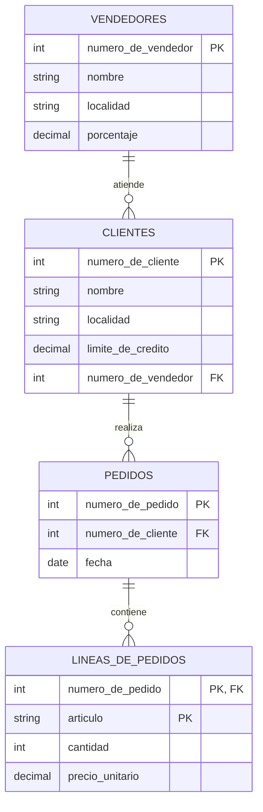

# Ejercicio 4

## Esquema de tablas

```text
clientes(numero_de_cliente, nombre, localidad, limite_de_credito, numero_de_vendedor)
vendedores(numero_de_vendedor, nombre, localidad, porcentaje)
pedidos(numero_de_pedido, numero_de_cliente, fecha)
lineas_de_pedidos(numero_de_pedido, articulo, cantidad, precio_unitario)
```

## Diagrama entidad-relación



## Consignas

**1.** Listar nombre y localidad de los clientes que piden en promedio más
de 100 artículos. *(la tabla `clientes` no tiene atributo "dirección", sino
"localidad")*

```{literalinclude} ejercicio-4-1.sql
```

**2.** Listar el o los nombres de los vendedores que venden artículos a
clientes de la localidad de Rosario cuyo precio unitario es mayor a $10.

```{literalinclude} ejercicio-4-2.sql
```

**3.** Listar el nombre y la localidad de los vendedores que tienen algún
cliente con su límite de crédito mayor al promedio de los límites de
crédito.

```{literalinclude} ejercicio-4-3.sql
```

**4.** Listar nombre y localidad de los clientes, junto con los artículos y
la cantidad pedida, de aquellos clientes atendidos por el vendedor número 5
el día 03/03/1991. *(mismo caso que en la consigna 1: se reemplazó
"dirección" por "localidad")*

```{literalinclude} ejercicio-4-4.sql
```

**5.** Listar los nombres de los vendedores que tengan un porcentaje mayor
al 7 % y que hayan vendido a más de un cliente de Rosario antes del
31/12/1991.

```{literalinclude} ejercicio-4-5.sql
```
