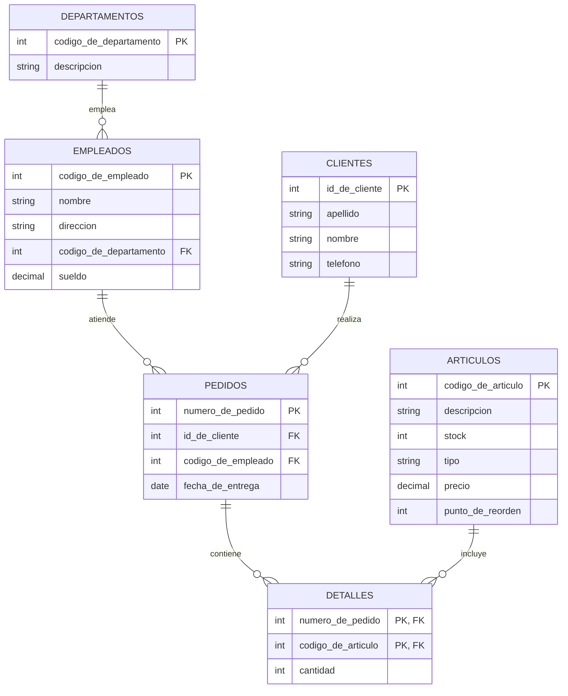

# Ejercicio 5

## Esquema de tablas

```text
empleados(codigo_de_empleado, nombre, direccion, codigo_de_departamento, sueldo)
departamentos(codigo_de_departamento, descripcion)
articulos(codigo_de_articulo, descripcion, stock, tipo, precio, punto_de_reorden)
pedidos(numero_de_pedido, id_de_cliente, codigo_de_empleado, fecha_de_entrega)
detalles(numero_de_pedido, codigo_de_articulo, cantidad)
clientes(id_de_cliente, apellido, nombre, telefono)
```

## Diagrama entidad-relación



## Consignas

**1.** Listar el total de unidades de cada artículo que hay que entregar la
próxima semana.

```{literalinclude} ejercicio-5-1.sql
```

**2.** Recuperar los diferentes artículos que no tienen pedidos (usando y
sin usar `NOT EXISTS`).

```{literalinclude} ejercicio-5-2.sql
```

**3.** Recuperar todos los pedidos de los clientes cuyo nombre empiece con
M.

```{literalinclude} ejercicio-5-3.sql
```

**4.** Recuperar todos los pedidos de los clientes cuyo nombre contenga una
T en mayúscula o minúscula.

```{literalinclude} ejercicio-5-4.sql
```

**5.** Buscar los clientes que no adquirieron el artículo "lápiz" (usando y
sin usar `NOT EXISTS`).

```{literalinclude} ejercicio-5-5.sql
```

**6.** Ver la lista de los clientes solo si el artículo "lápiz" está
disponible (`stock > punto_de_reorden`).

```{literalinclude} ejercicio-5-6.sql
```

**7.** Buscar el o los artículos de precio más alto y sus compradores.
*(la tabla se llama `articulos`, no `productos`; se corrigió el término
para que coincida con el esquema)*

```{literalinclude} ejercicio-5-7.sql
```

**8.** Listar la descripción de los departamentos y la cantidad de
empleados, aunque no tengan ningún empleado.

```{literalinclude} ejercicio-5-8.sql
```

**9.** Listar los apellidos, nombres y teléfonos de los clientes, y la
cantidad de pedidos del último mes, aunque no hayan comprado nada en ese
mes.

```{literalinclude} ejercicio-5-9.sql
```
