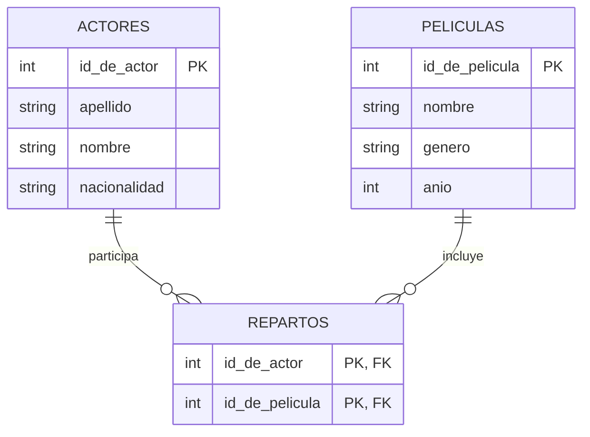

# Ejercicio 6

## Esquema de tablas

```text
actores(id_de_actor, apellido, nombre, nacionalidad)
peliculas(id_de_pelicula, nombre, genero, anio)
repartos(id_de_actor, id_de_pelicula)
```

## Diagrama entidad-relación



## Consignas

**1.** Listar el apellido y el nombre de los actores argentinos que no
trabajaron en ninguna película en el año 2020.

```{literalinclude} ejercicio-6-1.sql
```

**2.** Listar el apellido y el nombre de los actores que trabajaron en dos
películas que se estrenaron en el año 2016.

```{literalinclude} ejercicio-6-2.sql
```

**3.** Listar los apellidos de todos los actores argentinos y, si
trabajaron en alguna película del año 2015, listar el nombre de esas
películas (no importa que se repita el apellido si hizo más de una
película).

```{literalinclude} ejercicio-6-3.sql
```

**4.** Listar el nombre y el género de las películas que tienen más de 10
actores en su reparto. *(a la consigna original, "El nombre y género de las
películas...", le faltaba el verbo)*

```{literalinclude} ejercicio-6-4.sql
```
