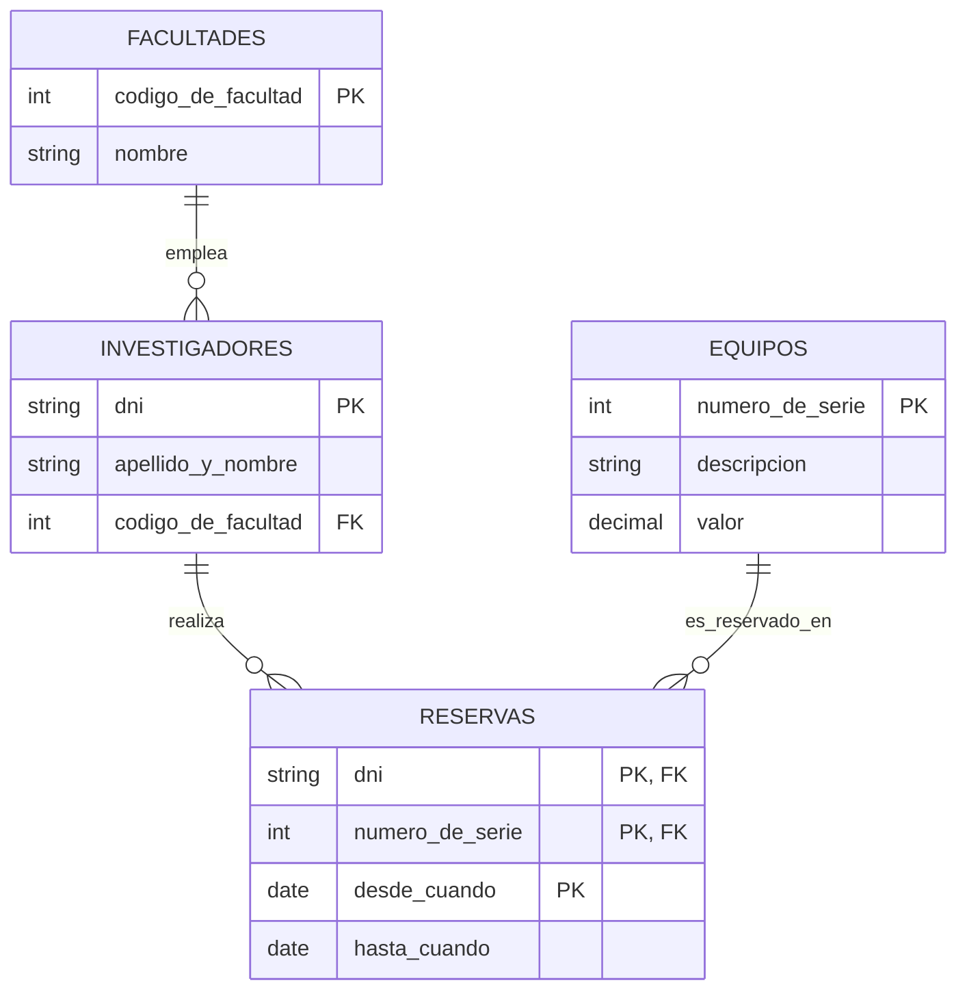

# Ejercicio 7

## Esquema de tablas

```text
facultades(codigo_de_facultad, nombre)
investigadores(dni, apellido_y_nombre, codigo_de_facultad)
equipos(numero_de_serie, descripcion, valor)
reservas(dni, numero_de_serie, desde_cuando, hasta_cuando)
```

## Diagrama entidad-relación



## Consignas

**1.** Listar todos los equipos y, si hay alguna reserva de hoy, mostrar el
apellido y nombre del investigador que hizo esa reserva. *(la tabla
`investigadores` tiene un único campo `apellido_y_nombre`, no `nombre`)*

```{literalinclude} ejercicio-7-1.sql
```

**2.** Listar el DNI y el apellido y nombre de aquellos investigadores que
realizaron más de una reserva. *(mismo ajuste que en la consigna anterior)*

```{literalinclude} ejercicio-7-2.sql
```

**3.** Listar el número de serie y la descripción de los equipos que nunca
fueron reservados. *(la tabla `equipos` tiene el campo `descripcion`, no
`nombre`)*

```{literalinclude} ejercicio-7-3.sql
```

**4.** Listar el nombre de la facultad y el apellido y nombre de los
investigadores que reservaron este año el equipo de mayor valor.

```{literalinclude} ejercicio-7-4.sql
```
