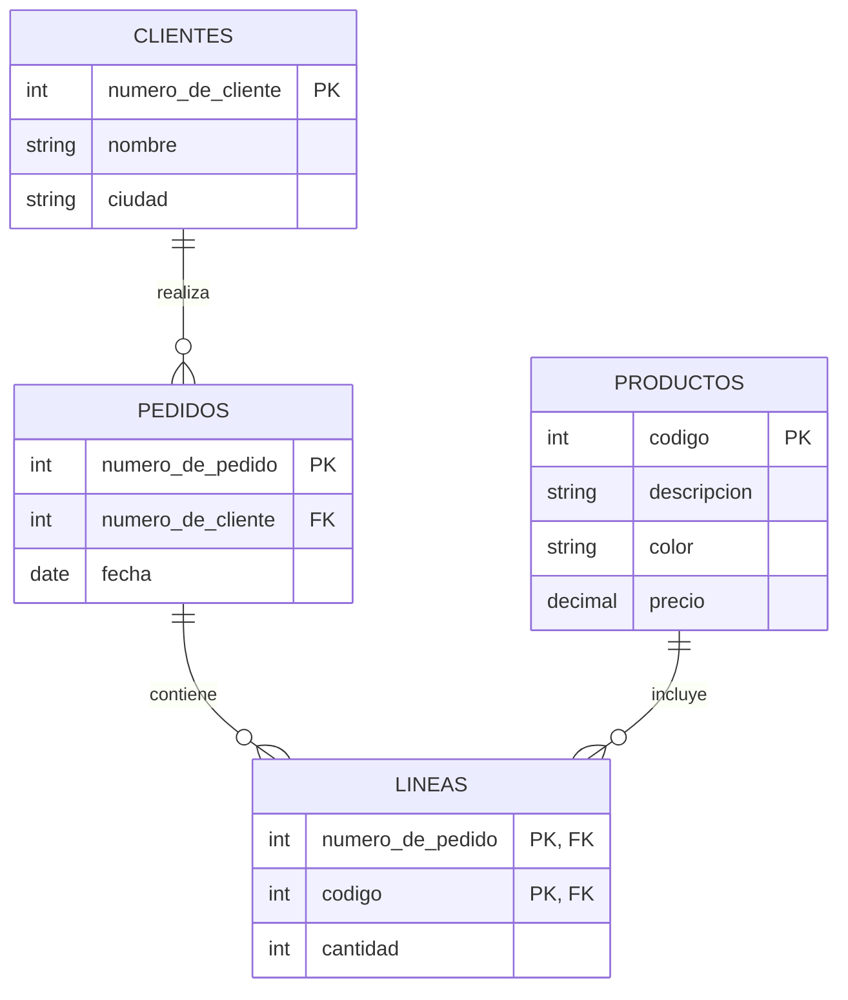
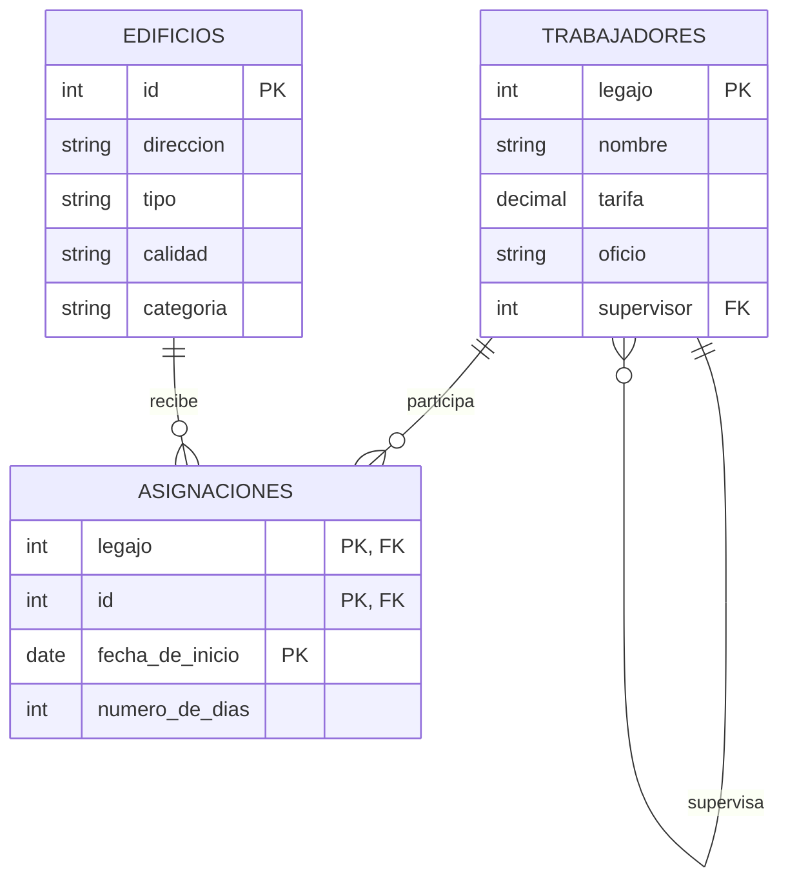
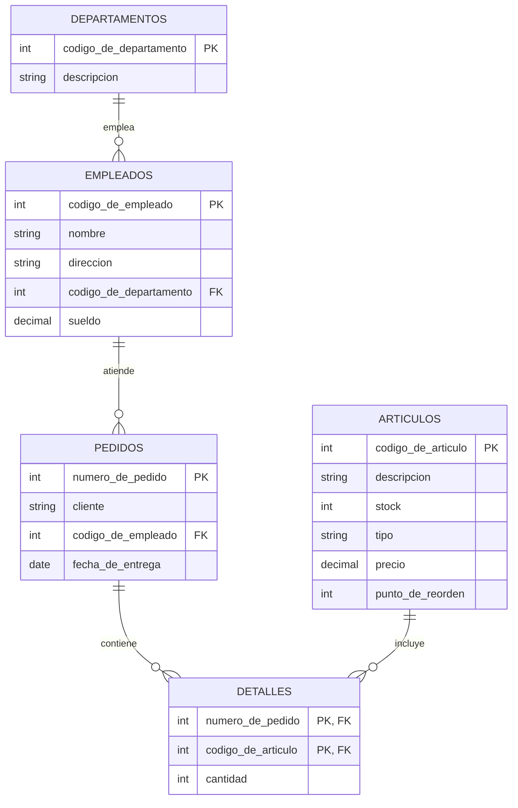
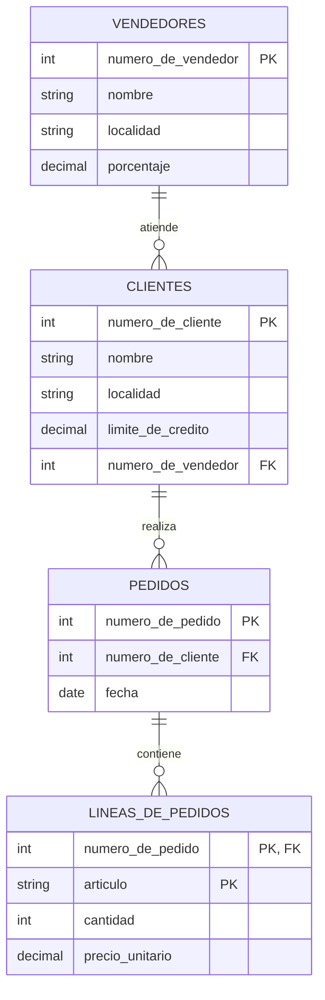
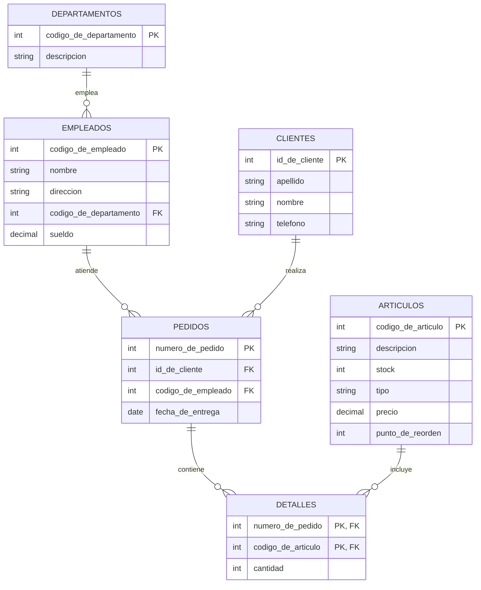
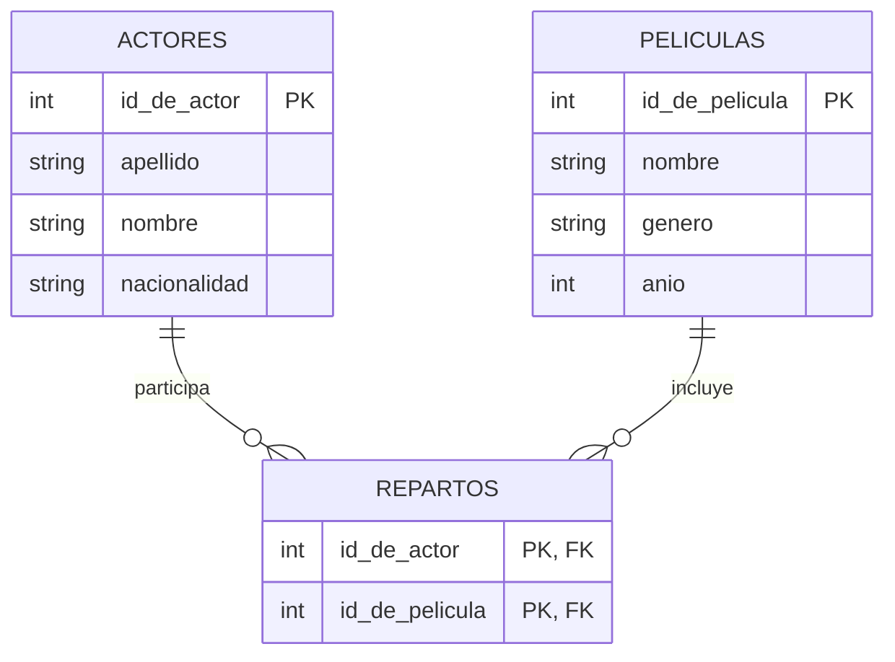
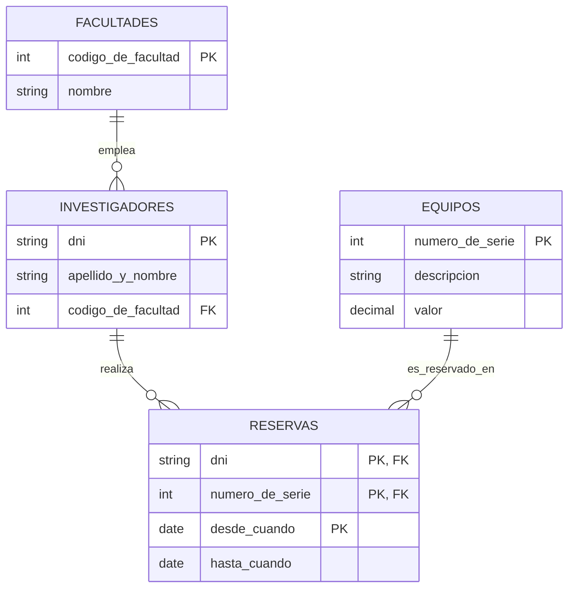

# Trabajo Práctico 1: Práctica SQL

Este documento reorganiza el TP original agregando, para cada ejercicio, un
diagrama entidad-relación (en Mermaid) que muestra las tablas y sus
relaciones, seguido de las consignas. Las consignas se dejaron **tal cual**
salvo en los casos donde había una inconsistencia con el esquema o un error
de redacción; esos casos están marcados con una nota en cursiva y explicados
al final de cada ejercicio.

---

## Ejercicio 1

### Esquema de tablas

```text
clientes(numero_de_cliente, nombre, ciudad)
productos(codigo, descripcion, color, precio)
pedidos(numero_de_pedido, numero_de_cliente, fecha)
lineas(numero_de_pedido, codigo, cantidad)
```

### Diagrama entidad-relación



### Consignas

1. Listar la descripción de los productos que fueron pedidos por algún
   cliente de Rosario.
2. Listar los nombres de los clientes y, para cada cliente, el monto total
   facturado (precio × cantidad) a partir del 10 de mayo de 1996, siempre que
   este monto supere los $1000.
3. Listar el nombre de los clientes que no compraron nada hoy.
4. Mostrar la descripción de los productos que se pidieron en la última
   semana.
5. Calcular la cantidad de colores distintos en los que el cliente de nombre
   "Pepe" pidió el producto de código 5.

---

## Ejercicio 2

### Esquema de tablas

```text
trabajadores(legajo, nombre, tarifa, oficio, supervisor)
edificios(id, direccion, tipo, calidad, categoria)
asignaciones(legajo, id, fecha_de_inicio, numero_de_dias)
```

### Diagrama entidad-relación



### Consignas

1. ¿Cuáles son los oficios de los trabajadores asignados al edificio 435?
2. Indicar el nombre del trabajador y el de su supervisor.
3. Listar el nombre de los trabajadores que no están asignados a ningún
   edificio cuya categoría sea "oficina".
4. Listar los nombres de los trabajadores que reciben una tarifa por hora
   mayor que la de su supervisor.
5. ¿Cuál es el número total de días que se dedicaron a la plomería en el
   edificio 312?

---

## Ejercicio 3

### Esquema de tablas

```text
empleados(codigo_de_empleado, nombre, direccion, codigo_de_departamento, sueldo)
departamentos(codigo_de_departamento, descripcion)
articulos(codigo_de_articulo, descripcion, stock, tipo, precio, punto_de_reorden)
pedidos(numero_de_pedido, cliente, codigo_de_empleado, fecha_de_entrega)
detalles(numero_de_pedido, codigo_de_articulo, cantidad)
```

### Diagrama entidad-relación



> Nota: `pedidos.cliente` es solo un dato textual (no hay tabla `clientes`
> en este ejercicio), por eso no aparece como relación en el diagrama.

### Consignas

1. Listar todos los datos de los artículos que se encuentren a menos de un
   10 % de su punto de reorden.
2. Recuperar el total de sueldos y el promedio de sueldos para cada
   departamento.
3. Listar los artículos que nunca fueron comprados por el cliente "Pepe".
4. Recuperar la cantidad de pedidos para cada empleado del departamento A.
5. Listar el nombre y el departamento del empleado de menor sueldo.
6. Recuperar los datos de los empleados que tienen más de 3 pedidos
   pendientes de entrega.
7. Recuperar la descripción de los departamentos para los cuales el
   promedio de sueldo de sus empleados es superior a $3000.
8. Recuperar los artículos para los cuales la cantidad pendiente de entrega
   supera al stock.
9. Contar cuántos departamentos distintos hay en la tabla de empleados.
10. Listar los artículos cuyo precio esté entre 20 y 50.
11. Listar todos los pedidos que contengan artículos del tipo A o B.
12. Recuperar el código y la descripción de los artículos que no tienen
    entregas pendientes.

---

## Ejercicio 4

### Esquema de tablas

```text
clientes(numero_de_cliente, nombre, localidad, limite_de_credito, numero_de_vendedor)
vendedores(numero_de_vendedor, nombre, localidad, porcentaje)
pedidos(numero_de_pedido, numero_de_cliente, fecha)
lineas_de_pedidos(numero_de_pedido, articulo, cantidad, precio_unitario)
```

### Diagrama entidad-relación



### Consignas

1. Listar nombre y localidad de los clientes que piden en promedio más de
   100 artículos. *(la tabla `clientes` no tiene atributo "dirección", sino
   "localidad")*
2. Listar el o los nombres de los vendedores que venden artículos a
   clientes de la localidad de Rosario cuyo precio unitario es mayor a $10.
3. Listar el nombre y la localidad de los vendedores que tienen algún
   cliente con su límite de crédito mayor al promedio de los límites de
   crédito.
4. Listar nombre y localidad de los clientes, junto con los artículos y la
   cantidad pedida, de aquellos clientes atendidos por el vendedor número 5
   el día 03/03/1991. *(mismo caso que en la consigna 1: se reemplazó
   "dirección" por "localidad")*
5. Listar los nombres de los vendedores que tengan un porcentaje mayor al
   7 % y que hayan vendido a más de un cliente de Rosario antes del
   31/12/1991.

---

## Ejercicio 5

### Esquema de tablas

```text
empleados(codigo_de_empleado, nombre, direccion, codigo_de_departamento, sueldo)
departamentos(codigo_de_departamento, descripcion)
articulos(codigo_de_articulo, descripcion, stock, tipo, precio, punto_de_reorden)
pedidos(numero_de_pedido, id_de_cliente, codigo_de_empleado, fecha_de_entrega)
detalles(numero_de_pedido, codigo_de_articulo, cantidad)
clientes(id_de_cliente, apellido, nombre, telefono)
```

### Diagrama entidad-relación



### Consignas

1. Listar el total de unidades de cada artículo que hay que entregar la
   próxima semana.
2. Recuperar los diferentes artículos que no tienen pedidos (usando y sin
   usar `NOT EXISTS`).
3. Recuperar todos los pedidos de los clientes cuyo nombre empiece con M.
4. Recuperar todos los pedidos de los clientes cuyo nombre contenga una T
   en mayúscula o minúscula.
5. Buscar los clientes que no adquirieron el artículo "lápiz" (usando y sin
   usar `NOT EXISTS`).
6. Ver la lista de los clientes solo si el artículo "lápiz" está disponible
   (`stock > punto_de_reorden`).
7. Buscar el o los artículos de precio más alto y sus compradores.
   *(la tabla se llama `articulos`, no `productos`; se corrigió el término
   para que coincida con el esquema)*
8. Listar la descripción de los departamentos y la cantidad de empleados,
   aunque no tengan ningún empleado.
9. Listar los apellidos, nombres y teléfonos de los clientes, y la cantidad
   de pedidos del último mes, aunque no hayan comprado nada en ese mes.

---

## Ejercicio 6

### Esquema de tablas

```text
actores(id_de_actor, apellido, nombre, nacionalidad)
peliculas(id_de_pelicula, nombre, genero, anio)
repartos(id_de_actor, id_de_pelicula)
```

### Diagrama entidad-relación



### Consignas

1. Listar el apellido y el nombre de los actores argentinos que no
   trabajaron en ninguna película en el año 2020.
2. Listar el apellido y el nombre de los actores que trabajaron en dos
   películas que se estrenaron en el año 2016.
3. Listar los apellidos de todos los actores argentinos y, si trabajaron en
   alguna película del año 2015, listar el nombre de esas películas (no
   importa que se repita el apellido si hizo más de una película).
4. Listar el nombre y el género de las películas que tienen más de 10
   actores en su reparto. *(a la consigna original, "El nombre y género de
   las películas...", le faltaba el verbo)*

---

## Ejercicio 7

### Esquema de tablas

```text
facultades(codigo_de_facultad, nombre)
investigadores(dni, apellido_y_nombre, codigo_de_facultad)
equipos(numero_de_serie, descripcion, valor)
reservas(dni, numero_de_serie, desde_cuando, hasta_cuando)
```

### Diagrama entidad-relación



### Consignas

1. Listar todos los equipos y, si hay alguna reserva de hoy, mostrar el
   apellido y nombre del investigador que hizo esa reserva. *(la tabla
   `investigadores` tiene un único campo `apellido_y_nombre`, no `nombre`)*
2. Listar el DNI y el apellido y nombre de aquellos investigadores que
   realizaron más de una reserva. *(mismo ajuste que en la consigna
   anterior)*
3. Listar el número de serie y la descripción de los equipos que nunca
   fueron reservados. *(la tabla `equipos` tiene el campo `descripcion`,
   no `nombre`)*
4. Listar el nombre de la facultad y el apellido y nombre de los
   investigadores que reservaron este año el equipo de mayor valor.

---

## Resumen de correcciones realizadas

| Ejercicio | Dónde | Cambio |
|---|---|---|
| 2 | Esquema `trabajadores` | El atributo `legajo` estaba repetido; se renombró el segundo a `supervisor` (auto-referencia). |
| 2 | Consigna 3 | Se agregó el verbo faltante y se aclaró que "oficina" es un valor del campo `categoria`. |
| 4 | Consignas 1 y 4 | Se reemplazó "dirección" por "localidad", que es el atributo real de `clientes`. |
| 5 | Consigna 7 | Se reemplazó "productos" por "artículos" para coincidir con el nombre de la tabla. |
| 6 | Consigna 4 | Se agregó el verbo faltante ("Listar"). |
| 7 | Consignas 1 y 2 | Se reemplazó "nombre" por "apellido y nombre", ya que `investigadores` solo tiene el campo combinado `apellido_y_nombre`. |
| 7 | Consigna 3 | Se reemplazó "nombre" por "descripción", que es el atributo real de `equipos`. |
