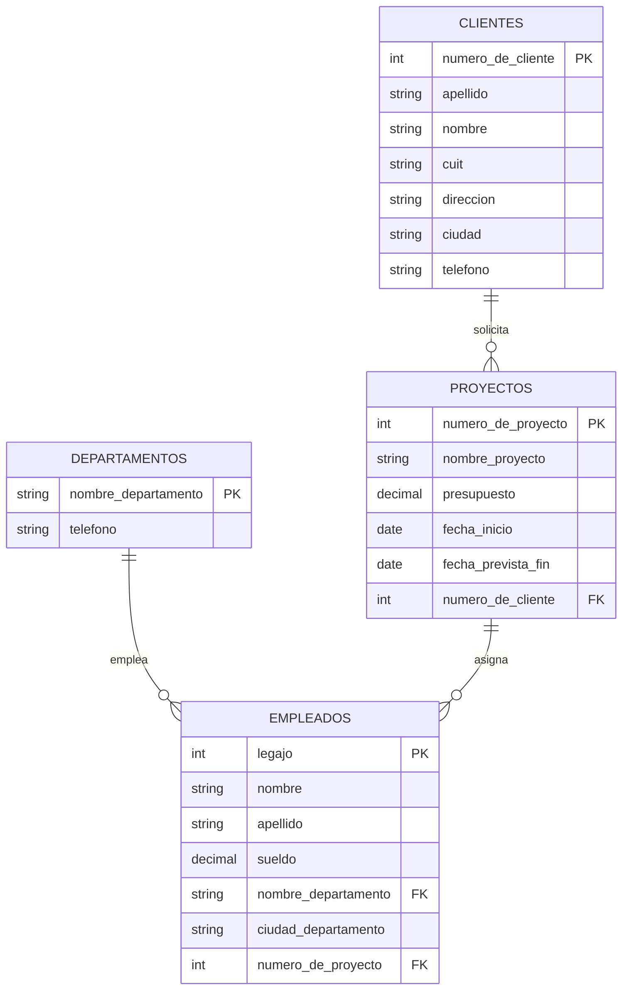

# Examen: Tema 1

Este documento reorganiza el Tema 1 del examen original (`SQL Tema 1 y 2.docx`)
agregando un diagrama entidad-relación (en Mermaid) que muestra las tablas y
sus relaciones, seguido de las consignas. Las consignas se dejaron **tal cual**
salvo en los casos donde había una inconsistencia con el esquema o un error de
redacción; esos casos están marcados con una nota en cursiva. Las claves
primarias originales estaban marcadas en negrita y subrayado; acá se indican
directamente en el esquema y en el diagrama.

---

## Esquema de tablas

```text
clientes(numero_de_cliente, apellido, nombre, cuit, direccion, ciudad, telefono)
departamentos(nombre_departamento, telefono)
proyectos(numero_de_proyecto, nombre_proyecto, presupuesto, fecha_inicio, fecha_prevista_fin, numero_de_cliente)
empleados(legajo, nombre, apellido, sueldo, nombre_departamento, ciudad_departamento, numero_de_proyecto)
```

## Diagrama entidad-relación



> Nota: `empleados.ciudad_departamento` es un dato textual propio del
> empleado (la tabla `departamentos` no tiene un campo `ciudad`), por eso no
> se representa como clave foránea en el diagrama. Además, `numero_de_proyecto`
> en `empleados` es una clave foránea opcional: un empleado puede no estar
> asignado a ningún proyecto, pero si lo está, es a lo sumo a uno.

## Consignas

**1.** Listar los legajos y los nombres de los empleados cuyo sueldo es el
más alto de la empresa.

```{literalinclude} tema-1-ejercicio-1.sql
```

**2.** Buscar los nombres y las ciudades de los clientes que no tienen
ningún proyecto. *(el original decía "tos clientes"; se corrigió a "los
clientes")*

```{literalinclude} tema-1-ejercicio-2.sql
```

**3.** Listar los números y los nombres de todos los clientes y, si tienen
algún proyecto, mostrar el nombre y el presupuesto del (o de los)
proyecto(s) (no importa si se repite el cliente).

```{literalinclude} tema-1-ejercicio-3.sql
```

**4.** Listar los números y nombres de los proyectos en los que el
promedio de los sueldos de sus empleados es menor a $8000.

```{literalinclude} tema-1-ejercicio-4.sql
```

**5.** Listar los departamentos en los que se pueda encontrar algún
empleado que trabaje en el proyecto de código 1.

```{literalinclude} tema-1-ejercicio-5.sql
```

**6.** Listar los empleados que no están en ningún proyecto con fecha
prevista de fin posterior a hoy.

```{literalinclude} tema-1-ejercicio-6.sql
```

**7.** Obtener los nombres de los departamentos que tienen empleados en
más de un proyecto.

```{literalinclude} tema-1-ejercicio-7.sql
```

**8.** Listar los nombres de todos los empleados y, si están asignados a
algún proyecto, mostrar el nombre del proyecto (el empleado puede no estar
asignado a ningún proyecto, pero si lo está, es a lo sumo a uno).

```{literalinclude} tema-1-ejercicio-8.sql
```
