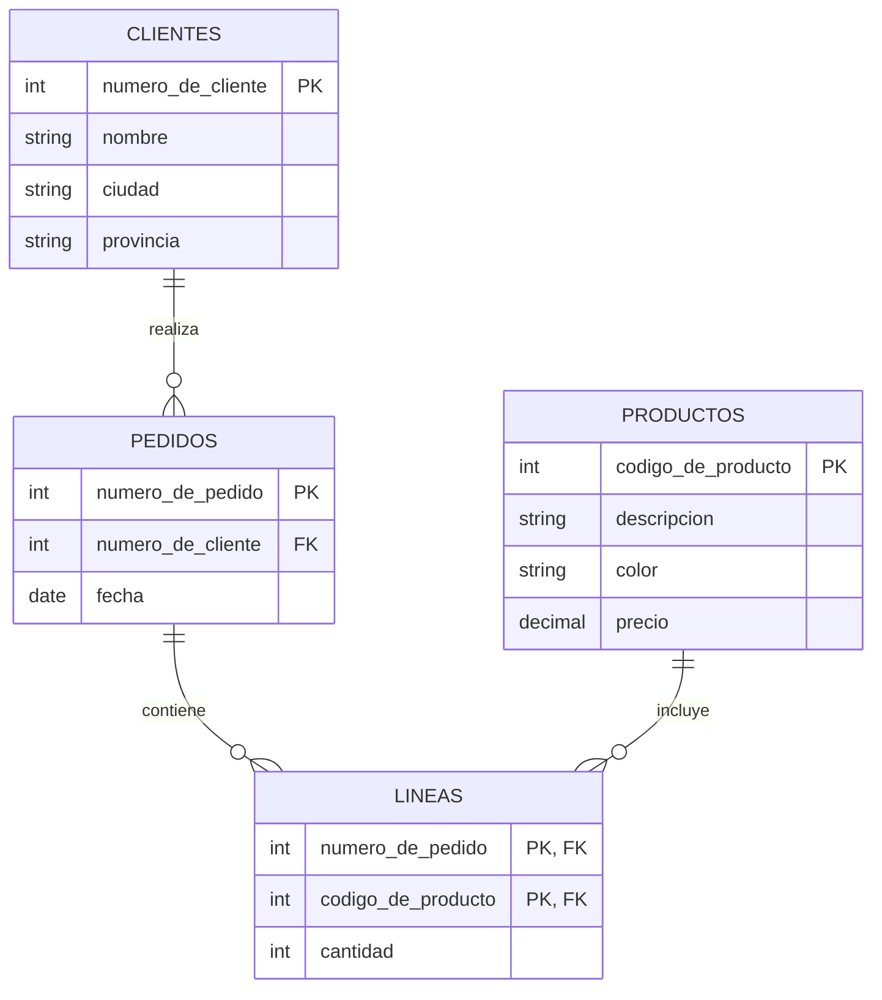

# Examen: Tema 2

Este documento reorganiza el Tema 2 del examen original (`SQL Tema 1 y 2.docx`)
agregando un diagrama entidad-relación (en Mermaid) que muestra las tablas y
sus relaciones, seguido de las consignas. Las consignas se dejaron **tal cual**
salvo en los casos donde había una inconsistencia con el esquema o un error de
redacción; esos casos están marcados con una nota en cursiva. Las claves
primarias originales estaban marcadas en negrita y subrayado; acá se indican
directamente en el esquema y en el diagrama.

---

## Esquema de tablas

```text
clientes(numero_de_cliente, nombre, ciudad, provincia)
productos(codigo_de_producto, descripcion, color, precio)
pedidos(numero_de_pedido, numero_de_cliente, fecha)
lineas(numero_de_pedido, codigo_de_producto, cantidad)
```

## Diagrama entidad-relación



## Consignas

**1.** Listar la descripción de los productos que no fueron pedidos por
ningún cliente de la provincia de La Rioja durante este mes. *(el original
decía "prov."; se escribió la palabra completa)*

```{literalinclude} tema-2-ejercicio-1.sql
```

**2.** Averiguar los nombres de los clientes que tengan pedidos con
productos de precio mayor al promedio de precios de todos los productos.

```{literalinclude} tema-2-ejercicio-2.sql
```

**3.** Listar los nombres de los clientes y, para cada cliente, el
promedio de la cantidad pedida en este año, siempre que tenga más de 20
pedidos en este año. *(el original decía "el promedio de lo pedido"; se
aclaró que se refiere al promedio de la cantidad pedida, `cantidad` en
`lineas`)*

```{literalinclude} tema-2-ejercicio-3.sql
```

**4.** Listar todos los clientes, y si pidieron algo este mes mostrar la
cantidad de pedidos de este mes.

```{literalinclude} tema-2-ejercicio-4.sql
```

**5.** Listar los clientes que hicieron alguna vez más de un pedido el
mismo día.

```{literalinclude} tema-2-ejercicio-5.sql
```

**6.** Encontrar el precio promedio de los productos que no se ofrecen en
color rojo.

```{literalinclude} tema-2-ejercicio-6.sql
```

**7.** Listar nombre y ciudad de los clientes que compraron productos cuyo
precio es mayor a 1000.

```{literalinclude} tema-2-ejercicio-7.sql
```

**8.** Listar todos los productos y, si fueron pedidos por algún cliente
de Rosario (ciudad), listar el nombre del cliente.

```{literalinclude} tema-2-ejercicio-8.sql
```
