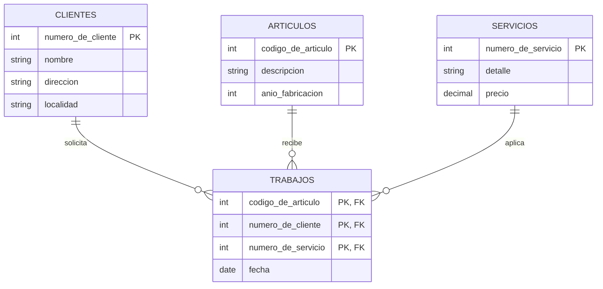

# Examen: Tema 3

Este documento reorganiza el Tema 3 del examen original (`SQL Tema 3 y 4.docx`)
agregando un diagrama entidad-relación (en Mermaid) que muestra las tablas y
sus relaciones, seguido de las consignas. Las consignas se dejaron **tal cual**
salvo en los casos donde había una inconsistencia con el esquema o un error de
redacción; esos casos están marcados con una nota en cursiva. Las claves
primarias originales estaban marcadas en negrita y subrayado; acá se indican
directamente en el esquema y en el diagrama.

---

## Esquema de tablas

```text
clientes(numero_de_cliente, nombre, direccion, localidad)
articulos(codigo_de_articulo, descripcion, anio_fabricacion)
servicios(numero_de_servicio, detalle, precio)
trabajos(codigo_de_articulo, numero_de_cliente, numero_de_servicio, fecha)
```

## Diagrama entidad-relación



> Nota: la tabla `trabajos` tenía subrayados (clave) los campos `codart`,
> `nrocliente` y `nroservicio`; se interpretó como una clave primaria
> compuesta por esos tres atributos, quedando `fecha` como un atributo
> regular (un mismo cliente no puede solicitar el mismo servicio para el
> mismo artículo más de una vez).

## Consignas

**1.** Contar los artículos de Juan para los cuales no se realizaron
trabajos durante este año.

```{literalinclude} tema-3-ejercicio-1.sql
```

**2.** Mostrar el nombre del cliente y cuánto pagó cada cliente, en total,
por todos los trabajos de este año, siempre que esa cifra supere los
$10 000. *(el original decía "Mostar" y "pago"; se corrigió a "Mostrar" y
"pagó")*

```{literalinclude} tema-3-ejercicio-2.sql
```

**3.** Nombre y dirección de los clientes que solicitaron trabajos para
un artículo con más de 10 años de fabricado con un precio del servicio
mayor a $100.

```{literalinclude} tema-3-ejercicio-3.sql
```

**4.** Listar la descripción de todos los artículos y, si realizó algún
servicio para un cliente de CABA (localidad) con fecha 01/01/2018, listar
también el nombre del cliente (no importa si la descripción del artículo
se repite).

```{literalinclude} tema-3-ejercicio-4.sql
```

**5.** Listar la descripción del artículo que se arregló más de 10 veces
este mes con servicios de precio mayor a 100.

```{literalinclude} tema-3-ejercicio-5.sql
```

**6.** Listar los nombres de todos los clientes de la localidad de
Rosario y si tienen algún trabajo este mes mostrar la descripción del
artículo (no importa que se repitan clientes o artículos).

```{literalinclude} tema-3-ejercicio-6.sql
```

**7.** Listar los clientes que nunca pidieron un servicio para un
artículo fabricado hace dos años.

```{literalinclude} tema-3-ejercicio-7.sql
```

**8.** Listar la descripción del (o los) artículo(s) más antiguo(s).

```{literalinclude} tema-3-ejercicio-8.sql
```
