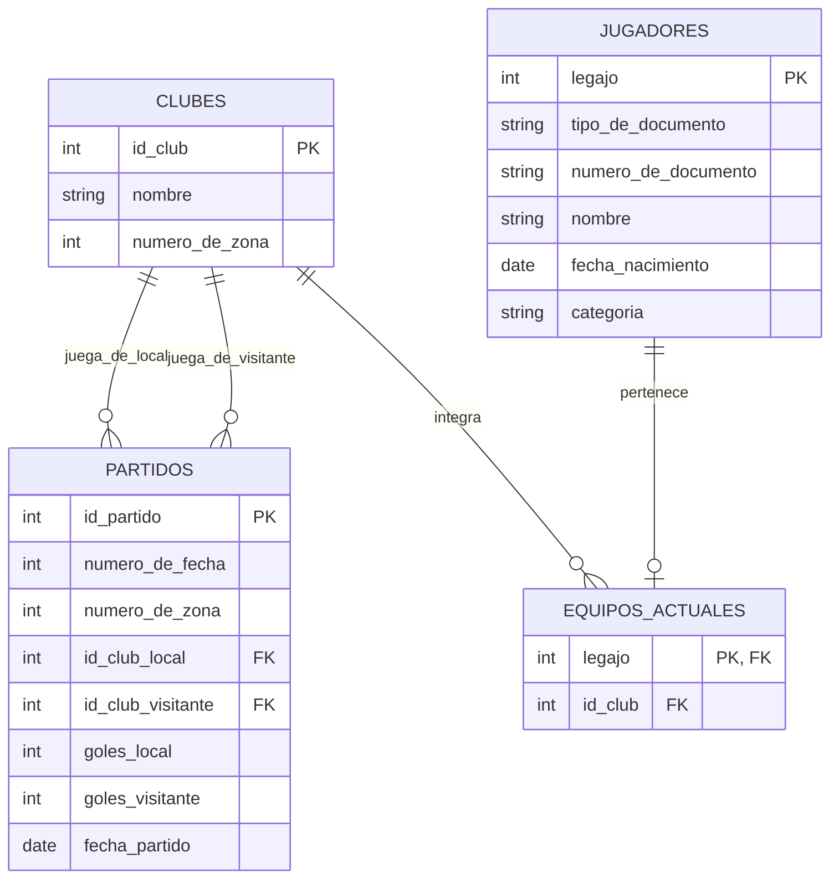

# Examen: Tema 4

Este documento reorganiza el Tema 4 del examen original (`SQL Tema 3 y 4.docx`)
agregando un diagrama entidad-relación (en Mermaid) que muestra las tablas y
sus relaciones, seguido de las consignas. Las consignas se dejaron **tal cual**
salvo en los casos donde había una inconsistencia con el esquema o un error de
redacción; esos casos están marcados con una nota en cursiva. Las claves
primarias originales estaban marcadas en negrita y subrayado; acá se indican
directamente en el esquema y en el diagrama.

---

## Esquema de tablas

```text
clubes(id_club, nombre, numero_de_zona)
jugadores(legajo, tipo_de_documento, numero_de_documento, nombre, fecha_nacimiento, categoria)
partidos(id_partido, numero_de_fecha, numero_de_zona, id_club_local, id_club_visitante, goles_local, goles_visitante, fecha_partido)
equipos_actuales(legajo, id_club)
```

## Diagrama entidad-relación



> Nota: `equipos_actuales` modela el club actual de cada jugador. Se usó
> `legajo` como clave primaria (en vez de la combinación `id_club` +
> `legajo`) porque, según la consigna 6, un jugador está a lo sumo en un club
> a la vez (y puede no estar en ninguno, es decir, estar "libre"). Además se
> corrigió el nombre de la columna `GolesVisistante` a `goles_visitante`
> (error de tipeo en el original).

## Consignas

**1.** Listar los partidos jugados como local o visitante por el club
cuyo nombre incluye la palabra "Los Andes".

```{literalinclude} tema-4-ejercicio-1.sql
```

**2.** Listar los clubes y la cantidad de goles de visitante de este año,
siempre que esa cantidad sea más de 10 goles.

```{literalinclude} tema-4-ejercicio-2.sql
```

**3.** Listar el nombre del jugador, su fecha de nacimiento y el club de
los jugadores más viejos en cada club (más viejo es fecha de nacimiento
menor a todas las otras fechas de nacimiento).

```{literalinclude} tema-4-ejercicio-3.sql
```

**4.** Listar nombre y zona de los clubes y, si jugaron algún partido
este mes, mostrar el número de zona y la fecha del partido.

```{literalinclude} tema-4-ejercicio-4.sql
```

**5.** Cantidad de jugadores por categoría de los clubes que no
participaron en la primera fecha del campeonato.

```{literalinclude} tema-4-ejercicio-5.sql
```

**6.** Listar los nombres y categorías de los jugadores y, si están en
algún equipo, mostrar el nombre del club (los jugadores pueden estar
"libre").

```{literalinclude} tema-4-ejercicio-6.sql
```

**7.** Listar todos los clubes que no jugaron partidos empatados.
*(el original decía "equipos"; se reemplazó por "clubes", que es el
nombre real de la tabla)*

```{literalinclude} tema-4-ejercicio-7.sql
```

**8.** Listar los partidos en donde los goles de visitante superaron al
promedio de los goles de visitante durante el año 2023.

```{literalinclude} tema-4-ejercicio-8.sql
```
